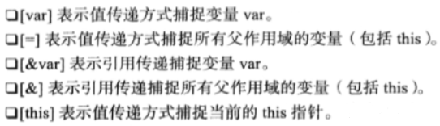
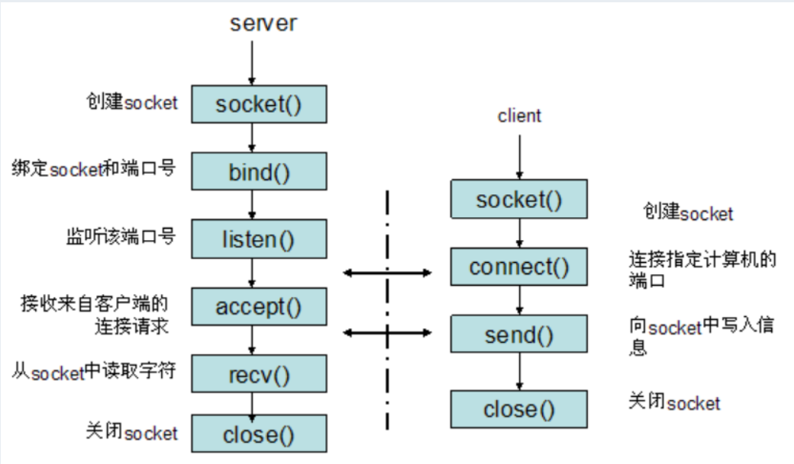
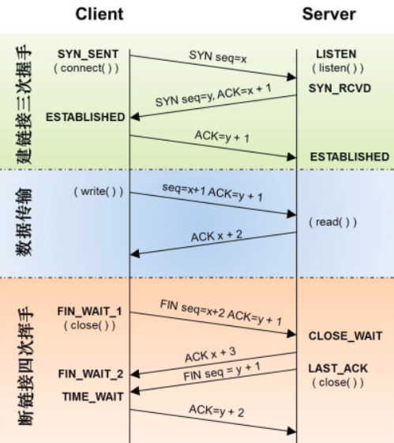
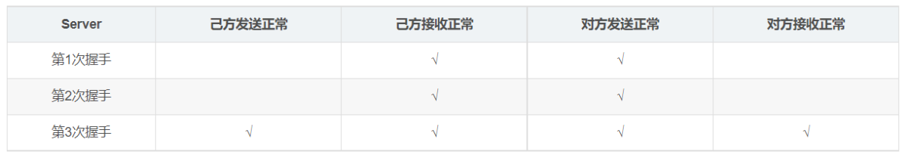
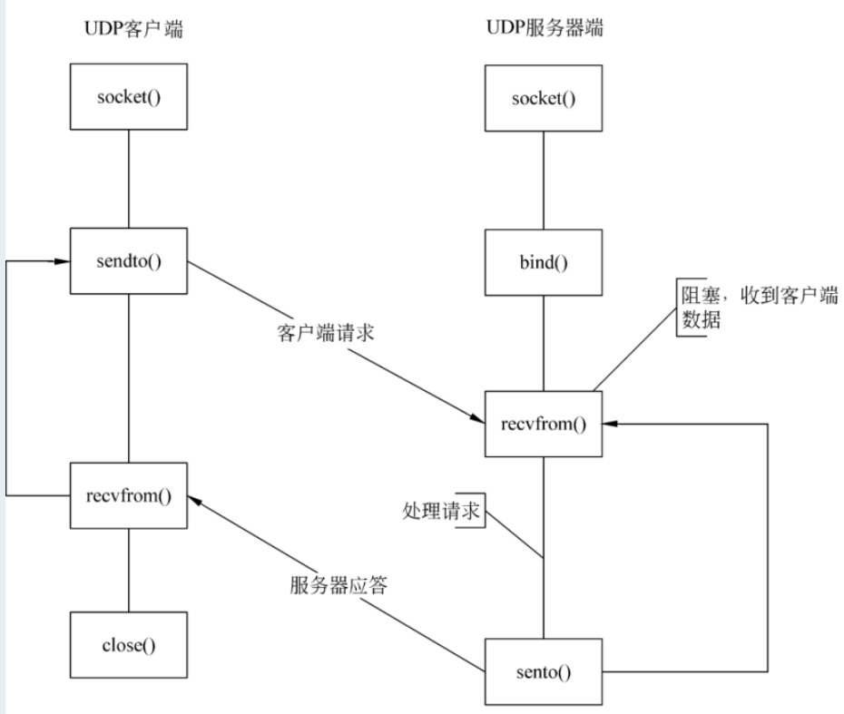
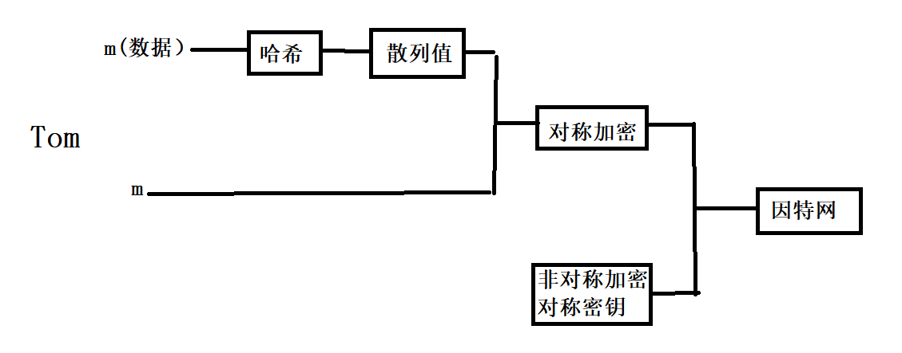
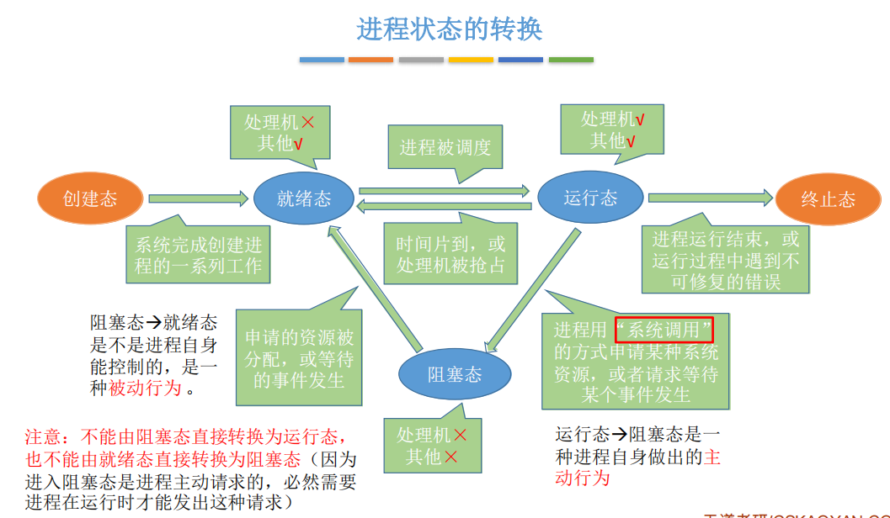
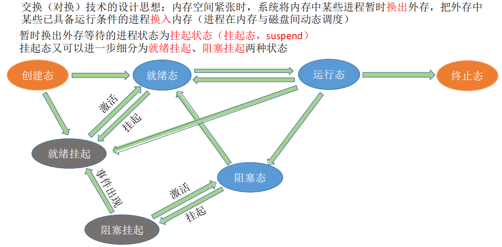
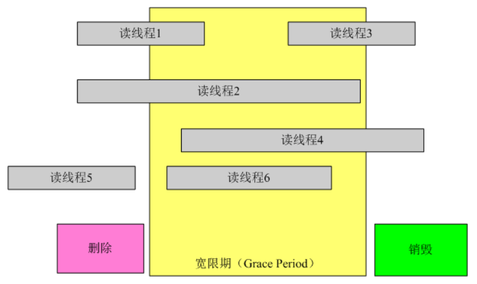
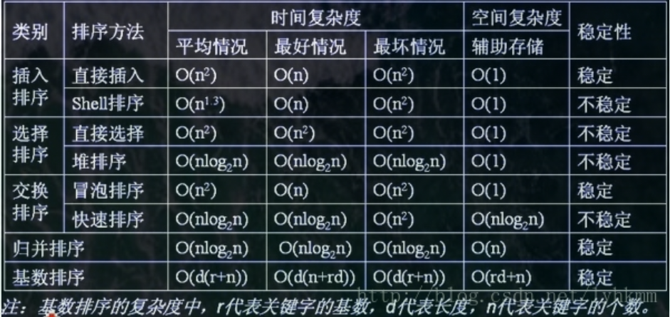

## C/C++

#### C/C++应用领域

C/C++是最接近操作系统底层的高级语言。

C是面向过程的编程，并且C可以直接生成机器码，也能直接访问寄存器，一般用于操作系统，嵌入式系统，嵌入式开发。主要原因是：C生成的可执行文件相对较小。

C++是面向对象的语言，具有封装，继承，和多态的特性，c能做的C++基本都能做，可以用于系统编程和驱动编程，一般用于开发大型应用，大型网络游戏等，应用范围很广，大型的项目且考虑运行效率的时候C++还是首选。

目前C++主要用于：

1. windows桌面应用开发，
2. 一些基础软件和高级语言的运行环境
3. 业务形应用软件的后台，游戏服务器等。

#### C语言更加适合与嵌入式编程原因是什么

1. **C语言具有良好的移植性**。C语言在不同的软硬件平台都能被很好的执行，

2. C**语言可以直接访问硬件。**可以用指针控制内存和寄存器，

3. C语言可以直接生成硬件识别的机器码，C++语言还需要语言解释器，然后再编译。所以嵌入式开发更加适合C语言。

   

#### strcpy及其实现

strcpy从源地址开始拷贝，直到遇到\0才结束。如果一直没有遇到\0，就会导致越界访问非法内存。

数组名为指向第一个元素的指针，为char *const类型的右值类型，右值类型不能被赋值。

```
char *my_strcpy(char *dst,const char *src)
{
	assert(dst != NULL);
	assert(src != NULL);
	char *ret = dst;
	while((* dst++ = * src++) != '\0') ;
	return ret;
}
```

需要注意：

1，检查指针有效性；

2，返回目的指针des；

3，源字符串的末尾 '\0' 需要拷贝。


但如果考虑到内存重叠

    char *my_strcpy(char *dst,const char *src)
    {
    	assert(dst != NULL);
    	assert(src != NULL);
    	char *ret = dst;
    	memcpy(dst,src,strlen(src)+1);
    	return ret;
    }
    void * my_memcpy(void *dst,const void *src,unsigned int count)
    {
         assert(dst);
         assert(src);
         void * ret = dst;
         if (dst <= src || (char *)dst >= ((char *)src + count))//源地址和目的地址不重叠，低字节向高字节拷贝
    	 {
    		 while(count--)
    		 {
    			 *(char *)dst = *(char *)src;
    			 dst = (char *)dst + 1;
    			 src = (char *)src + 1;
    		 }
    	 }
    	 else						//源地址和目的地址重叠，高字节向低字节拷贝
    	 { 
    		 dst = (char *)dst + count - 1;
    		 src = (char *)src + count - 1; 
    		 while(count--) 
    		 {
    			 *(char *)dst = *(char *)src;
    			 dst = (char *)dst - 1;
    			 src = (char *)src - 1;
    		 }
        }
    	return ret;
    }

[原文链接](https://blog.csdn.net/Gpengtao/article/details/7464061)


#### memcpy 与strcpy的区别

C/C++中mencpy的代码实现：https://www.cnblogs.com/goul/p/10191705.html

C/C++中strcpy的代码实现：https://www.cnblogs.com/goul/p/9569477.html

strcpy和memcpy主要有以下3方面的区别。

　　1、复制的内容不同。strcpy只能复制字符串，而memcpy可以复制任意内容，例如字符数组、整型、结构体、类等。

　　　　企业中使用memcpy很平常，因为需要拷贝大量的结构体参数。

　　　　memcpy通常与memset函数配合使用。

　　2、复制的方法不同。strcpy不需要指定长度，它遇到被复制字符的串结束符"\0"才结束，所以容易溢出。memcpy则是根据其第3个参数决定复制的长度。

　　　　因此strcpy会复制字符串的结束符“\0”，而memcpy则不会复制。

　　3、用途不同。通常在复制字符串时用strcpy，而需要复制其他类型数据时则一般用memcpy


#### 考察strlen(str)和sizeof(str)的区别：

  strlen(str)：统计字符串字符个数，不包含字符串默认结束符号\0;

  sizeof(str)：统计字符串所占字节数,包含字符串默认结束符号\0;

若字符数组 arr 作为函数的形参，sizeof(arr) 中 arr 被当作字符指针来处理，strlen(arr) 中 arr 依然是字符数组，从下述程序的运行结果中就可以看出。

```C++
#include <iostream>
#include <cstring>

using namespace std;

void size_of(char arr[])
{
    cout << sizeof(arr) << endl; // warning: 'sizeof' on array function parameter 'arr' will return size of 'char*' .
    cout << strlen(arr) << endl; 
}

int main()
{
    char arr[20] = "hello";
    size_of(arr); 
    return 0;
}
/*
输出结果：
8
5
*/

```


注：如果字符数组中间包含'\0'，则strlen只会到这就结束

#### 内存申请

申请内存时要记得的四个步骤：

1 判断内存大小是否是正数 

2 判断是否分配成功 

3 使用完要记得释放内存 

4 释放完指针后记得制空，否则可能变成野指针


#### 与“零值”比较的 if 语句

BOOL型变量：if(!var)  

int型变量： if(var==0)  

float型变量：  

const float EPSINON = 0.00001;  

if ((x >= - EPSINON) && (x <= EPSINON)  

指针变量：　　if(var==NULL)  

**注意：float double 存储时候，存储的并不是精确数。所以并不能跟0直接比较。需要一个范围。**


#### 数组名的本质

数组名的本质如下：  
（1）数组名指代一种数据结构，这种数据结构就是数组；  
例如：  

```
char str[10];
cout ＜＜ sizeof(str) ＜＜ endl;
```

输出结果为10，str指代数据结构char[10]。  
（2）数组名可以转换为指向其指代实体的指针，而且是一个指针常量，不能作自增、自减等操作，不能被修改；  
char str[10];  
str++; //编译出错，提示str不是左值 

（3）数组名作为函数形参时，沦为普通指针。 

Windows NT 32位平台下，指针的长度（占用内存的大小）为4字节，故sizeof( str ) 、sizeof ( p ) 都为4。 


#### 指针和数组的区别


#### 野指针

 “野指针”不是NULL指针，而是指向“垃圾”内存的指针。人们一般不会错用NULL指针，因为用if语句很容易判断。但是“野指针”是危险的，if语句对它不起作用。 

​     “野指针”的成因主要有两种： 

​     1、指针变量没有被初始化。任何指针变量刚被创建是不会自动成为NULL指针，它的默认值是随机的。所以，指针变量在创建的同时应当被初始化，要么将指针设置为NULL，要么让它指向合法的内存。 

​     2、指针被free或者delete之后，没有置为NULL，误以为是合法的指针。


####  写一个“标准”宏MAX

```
#define max(a, b) ((a) > (b) ? (a) : (b))
```

 这个版本，也是我们日常写代码最经常看到的版本

但如果测试代码如下

```
max(a++, b++)
/* 宏定义展开后是  ((a++) > (b++) ?（a++）:（b++）)*/
```

可以看到a、b都递增了两次

改进：使用中间变量

```
#define max(a, b) ({\
int _a = (a);\
int _b = (b);\
_a > _b ? _a : _b;\
})
```

 虽然上面版本的定义解决了++操作符引起的输出结果错误的问题，但是由于宏定义内部使用了int型的_a和_b作为中间变量，这就是限制了max宏定义只能用于2个int型的数据做比较，这将大大限制了它的使用范围。于是，很容易想到一个解决办法，将int这个数据类型使用type变量传进去，于是有了下面的版本: 

```
#define max(type, a, b) ({\
type _a = (a);\
type _b = (b);\
_a > _b ? _a : _b;\
})
```

但如果使用下面的测试用例

```
int a = 10;
float p = 10;
printf("result = %d\n", max(a, &p));
    /* 这样又能比较吗？*/
```

但是如果拿一个int型的变量跟一个float *变量做比较，或者两个奇奇怪怪的struct类型变量做计较，这样肯定是不行的。所以，我们在设计max宏定义的时候，需要将这种可能出现的问题尽可能地在编译阶段就暴露出来，于是有了Linux内核max宏定义的最佳版本：

```
#define max(a, b) ({\
typeof(a) _a = (a);\
typeof(a) _b = (b);\
(void) &_a == &_b;\
_a > _b ? _a : _b;\
})
```

我们注意，宏定义的第4行，(void) &_a == &_b; 意思是对_a和_b的地址做比较，实际上从运行结果上，这个肯定是不等的，但是我们关心的并不是两者比较的结果，而是两者能不能用==比较的问题。当_a和_b的数据类型一致时，代码编译不会有任何警告；反之，当两者的数据类型不一致时，比如之前的a是int型，而b是float型，那么这条语句就会报出编译警告，如果在严格的编译选项下，这个警告还可以转换为错误，要求代码调用者去确认结果，是否对两个不同类型的数据执行max比较的动作，从而将隐患消除，提升代码质量。
[原文链接](https://blog.csdn.net/szullc/article/details/84779352)


#### 为什么标准头文件都有类似以下的结构？

```
#ifndef __INCvxWorksh
#define __INCvxWorksh 
#ifdef __cplusplus
extern "C" {
#endif 
/*...*/ 
#ifdef __cplusplus
}
#endif 
#endif /* __INCvxWorksh */
```

```
#ifndef __INCvxWorksh
#define __INCvxWorksh 
#ifdef __cplusplus
```

这一段是用来防止头文件重复包含，vs可以使用#pragma once。但是推荐使用宏定义来防止重复包含，其跨平台，兼容性好。

```
#ifdef _cplusplus  //这句表示如果是c++文件
extern "c" {           //用extern "c"把一段代码包起来
#endif
#ifdef _cplusplus
}
#endif
```

1.这些都是预编译命令 

  解释extern "C" 

  2.cpp文件编译器会自己定义__cplusplus宏

  3extern "c"有两个作用

  1表示函数或变量时extern的，可以在本模块和其他模块使用

  2为了在C++代码中使用c代码，有此声明后编译器会按照C的编译规则来编译那些代码

  原因：c++支持重载，所以在编译成汇编时，真实函数名会带上函数的参数，而c不支持重载使用原函数名。这样就找不到在别的模块中使用c规则编译的此函数的代码，这时就会报连接错误


#### 判断系统是小端还是大端

```
int checkCPU()
{
    {
    union w
    { 
        int a;
        char b;
    } c;
    c.a = 1;
    return (c.b == 1);
    }
}
```

数0x1234在小端模式CPU内存中的存放方式（假设从地址0x4000开始存放）为： 

| 内存地址 | 存放内容 |
| -------- | -------- |
| 0x4000   | 0x34     |
| 0x4001   | 0x12     |

而在大端模式CPU内存中的存放方式则为： 

| 内存地址 | 存放内容 |
| -------- | -------- |
| 0x4000   | 0x12     |
| 0x4001   | 0x34     |

union 联合体是共用内存区域，也就是说int 和 char一起公用4byte.并且union一定是从低地址开始存放，所以char b对应最低内存区域，只要判断b是否为1即可。如果是大端存储，int的1存在最高位，返回false；小端存储时1存在最低位，返回true；


第二种方法

```C++
BOOL IsBigEndian()  
{  
    int a = 0x1234;  
    char b =  *(char *)&a;  //通过将int强制类型转换成char单字节，通过判断起始存储位置。即等于 取b等于a的低地址部分  
    if( b == 0x12)  
    {  
        return TRUE;  
    }  
    return FALSE;  
}
```


#### 小端和大端优缺点

大端小端没有谁优谁劣，各自优势便是对方劣势：

小端模式 ：强制转换数据不需要调整字节内容，1、2、4字节的存储方式一样。计算机计算时从低位开始计算
大端模式 ：符号位的判定固定为第一个字节，容易判断正负。符合人类的阅读习惯

注：大小端是以字节为单位，不是以bit为单位，例如char无需考虑大小端

网络字节序是大端


#### C/C++ 中指针和引用的区别

1.指针有自己的一块空间，而引用只是一个别名；

2.使用sizeof看一个指针的大小是4，而引用则是被引用对象的大小；

3.指针可以被初始化为NULL，而引用必须被初始化且必须是一个已有对象 的引用；

4.作为参数传递时，指针需要被解引用才可以对对象进行操作，而直接对引 用的修改都会改变引用所指向的对象；

5.可以有const指针，但是没有const引用；

6.指针在使用中可以指向其它对象，但是引用只能是一个对象的引用，不能 被改变；

7.指针可以有多级指针（**p），而引用至于一级；

8.指针和引用使用++运算符的意义不一样；

9.如果返回动态内存分配的对象或者内存，必须使用指针，引用可能引起内存泄露。


#### set和map的区别

map和set都是C++的关联容器，其底层实现都是红黑树（RB-Tree）。由于 map 和set所开放的各种操作接口，RB-tree 也都提供了，所以几乎所有的 map 和set的操作行为，都只是转调 RB-tree 的操作行为。

map和set区别在于：

（1）map中的元素是key-value（关键字—值）对：关键字起到索引的作用，值则表示与索引相关联的数据；Set与之相对就是关键字的简单集合，set中每个元素只包含一个关键字。

（2）set的迭代器是const的，不允许修改元素的值；map允许修改value，但不允许修改key。其原因是因为map和set是根据关键字排序来保证其有序性的，如果允许修改key的话，那么首先需要删除该键，然后调节平衡，再插入修改后的键值，调节平衡，如此一来，严重破坏了map和set的结构，导致iterator失效，不知道应该指向改变前的位置，还是指向改变后的位置。所以STL中将set的迭代器设置成const，不允许修改迭代器的值；而map的迭代器则不允许修改key值，允许修改value值。

（3）map支持下标操作，set不支持下标操作。map可以用key做下标，map的下标运算符[ ]将关键码作为下标去执行查找，如果关键码不存在，则插入一个具有该关键码和mapped_type类型默认值的元素至map中，因此下标运算符[ ]在map应用中需要慎用，const_map不能用，只希望确定某一个关键值是否存在而不希望插入元素时也不应该使用，mapped_type类型没有默认值也不应该使用。如果find能解决需要，尽可能用find。


#### malloc的原理，brk系统调用和mmap系统调用的作用

Malloc函数用于动态分配内存。为了减少内存碎片和系统调用的开销，malloc其采用内存池的方式，先申请大块内存作为堆区，然后将堆区分为多个内存块，以块作为内存管理的基本单位。当用户申请内存时，直接从堆区分配一块合适的空闲块。Malloc采用隐式链表结构将堆区分成连续的、大小不一的块，包含已分配块和未分配块；同时malloc采用显示链表结构来管理所有的空闲块，即使用一个双向链表将空闲块连接起来，每一个空闲块记录了一个连续的、未分配的地址。

当进行内存分配时，Malloc会通过隐式链表遍历所有的空闲块，选择满足要求的块进行分配；当进行内存合并时，malloc采用边界标记法，根据每个块的前后块是否已经分配来决定是否进行块合并。

Malloc在申请内存时，一般会通过brk或者mmap系统调用进行申请。其中当申请内存小于128K时，会使用系统函数brk在堆区中分配；而当申请内存大于128K时，会使用系统函数mmap在映射区分配。


brk() 函数实现原理：向高地址的方向移动指向数据段的高地址的指针 _enddata。
mmap 内存映射原理：
进程启动映射过程，并在虚拟地址空间中为映射创建虚拟映射区域；
调用内核空间的系统调用函数 mmap()，实现文件物理地址和进程虚拟地址的一一映射关系；
进程发起对这片映射空间的访问，引发缺页异常，实现文件内容到物理内存（主存）的拷贝。


#### new和malloc的区别

1、new分配内存按照数据类型进行分配，malloc分配内存按照指定的大小分配；

2、new返回的是指定对象的指针，而malloc返回的是void*，因此malloc的返回值一般都需要进行类型转化。

3、new不仅分配一段内存，而且会调用构造函数，malloc不会。

4、new分配的内存要用delete销毁，malloc要用free来销毁；delete销毁的时候会调用对象的析构函数，而free则不会。

5、new是一个操作符可以重载，malloc是一个库函数。

6、malloc分配的内存不够的时候，可以用realloc扩容。扩容的原理？new没用这样操作。

7、new如果分配失败了会抛出bad_malloc的异常，而malloc失败了会返回NULL。

8、申请数组时： new[]一次分配所有内存，多次调用构造函数，搭配使用delete[]，delete[]多次调用析构函数，销毁数组中的每个对象。而malloc则只能sizeof(int) * n。


#### new申请的内存能用free释放吗？

new和delete的本质是一个函数，malloc和free只是这两个函数中的一句调用语句，所以当你用new申请内存，却用free释放，相当于用整个函数来申请内存并维护了一个逻辑使内存方便使用，但是只用了一个free语句就释放掉内存，使这个逻辑出现错误，因为这是个逻辑错误而不是语法错误，所以编译器不会识别（牛B的可能会警告），运行时如果你的程序指令有严重问题，只好段错误或吐核，碰巧这个问题没有影响到操作系统，也不说明这是一个良好的程序。示例如下：

```c++
#define _CRT_SECURE_NO_WARNINGS
#include <iostream>
#include <string.h>
//#include <bits/stdc++.h> //c++万能头
using namespace std;


class test
{
private:
public:
    int num;
    char* str1;
    test();
    ~test();
};

test::test()
{
    cout << "construct" << endl;
    num = 10;
    str1 = (char*)malloc(10);
    strcpy(str1, "hello");
}

test::~test()
{
    cout << "destroy" << endl;
    free(str1);
}


int main()
{
    test* a = new test();
    test* b = new test();
    cout << a->str1 << endl;
    cout << b->str1 << endl;
    cout << a->num << endl;
    cout << b->num << endl;
    char* tmpa = a->str1;
    char* tmpb = b->str1;
    delete a;
    free(b);

    cout << "tmpb:" << tmpb << endl;
    cout << "tmpa:" << tmpa << endl;
    
    int* p = new int(1);
    cout << *p << endl;
    free(p);
    //delete p;
    cout << *p << endl;
    
    int* q = new int[5];
    q[0] = 10;
    q[1] = 11;
    q[2] = 12;
    q[3] = 13;
    q[4] = 14;
    
    cout << *(q + 2) << endl;
    free(q);
    //delete q;
    //delete[] q;
    cout << *(q + 2) << endl;


    //system("cls");
    return 0;

}
```

new出来的内存之后使用free释放，语法不会报错，但free不会调用析构函数，如果对象有在堆区申请内存，不会释放；free释放之后仍可访问，但内容是乱码，delete释放后如果仍然要访问，程序运行到这条语句时会报错。对于基本数据类型，使用free不会有问题。


####  在栈上动态分配内存

C提供了在**栈中动态分配内存**的函数`alloca`，用法和`malloc`一样，但不用`free`，因为他是在栈中分配空间，超出定义域后自动释放:

```cpp
int lenght = 10;
char* str = (char*)alloca(length * sizeof(char));
```

使用 alloca()(有时称为 _alloca() 或 _malloca() )，但是 要非常小心 —它会在您离开函数时释放内存，而不是在超出范围时释放内存，因此如果在循环中使用它，您很快就会崩溃。


#### calloc相关

calloc在堆中申请数组内存
原型：void* calloc（unsigned int num，unsigned int size）；
功能：在内存的动态存储区中分配num个长度为size的连续空间；
注意：num：对象个数，size：对象占据的内存字节数，相较于malloc函数，calloc函数会自动将内存初始化为0；


#### STL组成

STL可分为容器(containers)、迭代器(iterators)、空间配置器(allocator)、配接器(adapters)、算法(algorithms)、仿函数(functors)六个部分

空间配置器实现动态对空间的分配，管理和释放，算法通过迭代器获取容器中的内容，仿函数可以协助算法完成各种操作，配接器用来套接适配仿函数


#### STL删除元素后的迭代器

1.对于序列容器vector,deque来说，使用erase(itertor)后，后边的每个元素的迭代器都会失效，但是后边每个元素都会往前移动一个位置，但是erase会返回下一个有效的迭代器；

2.对于关联容器map set来说，使用了erase(iterator)后，当前元素的迭代器失效，但是其结构是红黑树，删除当前元素的，不会影响到下一个元素的迭代器，所以在调用erase之前，记录下一个元素的迭代器即可。

3.对于list来说，它使用了不连续分配的内存，并且它的erase方法也会返回下一个有效的iterator，因此上面两种正确的方法都可以使用。


#### resize和reverse

reserve是设置了capacity的值，比如reserve(20)，表示该容器最大容量为20，但此时容器内还没有任何对象，也不能通过下标访问。

**resize既分配了空间，也创建了对象，可以通过下标访问。当resize的大小**

**reserve只修改capacity大小，不修改size大小，resize既修改capacity大小，也修改size大小。**

reserve是容器预留空间，但并不真正创建元素对象，在创建对象之前，不能引用容器内的元素，因此当加入新的元素时，需要用push_back()/insert()函数。

resize是改变容器的大小，并且创建对象，因此，调用这个函数之后，就可以引用容器内的对象了，因此当加入新的元素时，用operator[]操作符，或者用迭代器来引用元素对象。

再者，两个函数的形式是有区别的，reserve函数之后一个参数，即需要预留的容器的空间；resize函数可以有两个参数，第一个参数是容器新的大小，第二个参数是要加入容器中的新元素，如果这个参数被省略，那么就调用元素对象的默认构造函数。

这两个接口即存在差别，也有共同点。下面就它们的细节进行分析。
为实现resize的语义，resize接口做了两个保证：
一是保证区间[0, new_size)范围内数据有效，如果下标index在此区间内，[vector](https://so.csdn.net/so/search?q=vector&spm=1001.2101.3001.7020)[indext]是合法的。
二是保证区间[0, new_size)范围以外数据无效，如果下标index在区间外，vector[indext]是非法的。
reserve只是保证vector的空间大小(capacity)最少达到它的参数所指定的大小n。在区间[0, n)范围内，如果下标是index，vector[index]这种访问有可能是合法的，也有可能是非法的，视具体情况而定。

**resize和reserve接口的共同点是它们都保证了vector的空间大小(capacity)最少达到它的参数所指定的大小。**

#### hash如何rehash

C++的hash表中有一个负载因子loadFactor，当loadFactor<=1时，hash表查找的期望复杂度为O(1). 因此，每次往hash表中添加元素时，我们必须保证是在loadFactor <1的情况下，才能够添加。

因此，当Hash表中loadFactor==1时，Hash就需要进行rehash。rehash过程中，会模仿C++的vector扩容方式，Hash表中每次发现loadFactor ==1时，就开辟一个原来桶数组的两倍空间，称为新桶数组，然后把原来的桶数组中元素全部重新哈希到新的桶数组中。


#### 如何进行函数调用

每个函数调用都会分配**函数栈**，在栈内进行函数执行过程。调用函数前，先将**参数和返回地址压栈**，然后将当前函数的ebp指针压栈，之后修改ebp和esp指针，为调用的函数创建新的栈帧结构。


#### 如何让某个函数在main之前调用

全局static变量的初始化在程序初始阶段，先于main函数的执行

在函数名前加上`__attribute((constructor))`，它是是gcc扩展，标记这个函数应当在main函数之前执行。同样有一个`__attribute((destructor))`，标记函数应当在程序结束之前（main结束之后，或者调用了exit后）执行


#### const相关

（1）欲阻止一个变量被改变，可以使用const关键字。在定义该const变量时，通常需要对它进行初始化，因为以后就没有机会再去改变它了； 
（2）对指针来说，可以指定指针本身为const，也可以指定指针所指的数据为const，或二者同时指定为const； 
（3）在一个函数声明中，const可以修饰形参，表明它是一个输入参数，在函数内部不能改变其值； 
（4）对于类的成员函数，若指定其为const类型，则表明其是一个常函数，不能修改类的 成员变量； 
（5）对于类的成员函数，有时候必须指定其返回值为const类型，以使得其返回值不为“左值”。例如： 
const classA operator*(const classA& a1,const classA& a2); 
operator*的返回结果必须是一个const对象。如果不是，这样的变态代码也不会编译出错： 
classA a, b, c; 
(a * b) = c; // 对a*b的结果赋值 
操作(a * b) = c显然不符合编程者的初衷，也没有任何意义。 


#### define和const相关

区别：

编译阶段：define 是在编译预处理阶段进行替换，const 是在编译阶段确定其值。
安全性：define 定义的宏常量没有数据类型，只是进行简单的替换，不会进行类型安全的检查；const 定义的常量是有类型的，是要进行判断的，可以避免一些低级的错误。
内存占用：define 定义的宏常量，在程序中使用多少次就会进行多少次替换，内存中有多个备份，占用的是代码段的空间；const 定义的常量占用静态存储区的空间，程序运行过程中只有一份。
调试：define 定义的宏常量不能调试，因为在预编译阶段就已经进行替换了；const 定义的常量可以进行调试。
const 的优点：

有数据类型，在定义式可进行安全性检查。
可调式。
占用较少的空间。


#### define和const区别

区别：

编译阶段：define 是在编译预处理阶段进行替换，const 是在编译阶段确定其值。
安全性：define 定义的宏常量没有数据类型，只是进行简单的替换，不会进行类型安全的检查；const 定义的常量是有类型的，是要进行判断的，可以避免一些低级的错误。
内存占用：define 定义的宏常量，在程序中使用多少次就会进行多少次替换，内存中有多个备份，占用的是代码段的空间；const 定义的常量占用静态存储区的空间，程序运行过程中只有一份。
调试：define 定义的宏常量不能调试，因为在预编译阶段就已经进行替换了；const 定义的常量可以进行调试。
const 的优点：

有数据类型，在定义式可进行安全性检查。
可调式。
占用较少的空间。


#### 静态变量

\1. 全局静态变量

在全局变量前加上关键字static，全局变量就定义成一个全局静态变量.

静态存储区，在整个程序运行期间一直存在。

初始化：未经初始化的全局静态变量会被自动初始化为0（自动对象的值是任意的，除非他被显式初始化）；

作用域：全局静态变量在声明他的文件之外是不可见的，准确地说是从定义之处开始，到文件结尾。

\2.  局部静态变量

在局部变量之前加上关键字static，局部变量就成为一个局部静态变量。

内存中的位置：静态存储区

初始化：未经初始化的全局静态变量会被自动初始化为0（自动对象的值是任意的，除非他被显式初始化）；

作用域：作用域仍为局部作用域，当定义它的函数或者语句块结束的时候，作用域结束。但是当局部静态变量离开作用域后，并没有销毁，而是仍然驻留在内存当中，只不过我们不能再对它进行访问，直到该函数再次被调用，并且值不变；

\3. 静态函数

在函数返回类型前加static，函数就定义为静态函数。函数的定义和声明在默认情况下都是extern的，但静态函数只是在声明他的文件当中可见，不能被其他文件所用。

函数的实现使用static修饰，那么这个函数只可在本cpp内使用，不会同其他cpp中的同名函数引起冲突；

warning：不要再头文件中声明static的全局函数，不要在cpp内声明非static的全局函数，如果你要在多个cpp中复用该函数，就把它的声明提到头文件里去，否则cpp内部声明需加上static修饰；

\4. 类的静态成员

在类中，静态成员可以实现多个对象之间的数据共享，并且使用静态数据成员还不会破坏隐藏的原则，即保证了安全性。因此，静态成员是类的所有对象中共享的成员，而不是某个对象的成员。对多个对象来说，静态数据成员只存储一处，供所有对象共用

\5. 类的静态函数

静态成员函数和静态数据成员一样，它们都属于类的静态成员，它们都不是对象成员。因此，对静态成员的引用不需要用对象名。

在静态成员函数的实现中不能直接引用类中说明的非静态成员，可以引用类中说明的静态成员（这点非常重要）。如果静态成员函数中要引用非静态成员时，可通过对象来引用。从中可看出，调用静态成员函数使用如下格式：<类名>::<静态成员函数名>(<参数表>);


#### 静态变量初始化

静态变量存储在虚拟地址空间的数据段和bss段，C语言中其在代码执行之前初始化，属于编译期初始化。而C++中由于引入对象，对象生成必须调用构造函数，因此C++规定全局或局部静态对象当且仅当对象首次用到时进行构造


## **C++类相关**


#### 类的内存分布

1、static修饰符

1）static修饰成员变量

对于非静态数据成员，每个类对象都有自己的拷贝。而静态数据成员被当做是类的成员，无论这个类被定义了多少个，静态数据成员都只有一份拷贝，为该类型的所有对象所共享(包括其派生类)。所以，静态数据成员的值对每个对象都是一样的，它的值可以更新。

因为静态数据成员在全局数据区分配内存，属于本类的所有对象共享，所以它不属于特定的类对象，在没有产生类对象前就可以使用。

2）static修饰成员函数

与普通的成员函数相比，静态成员函数由于不是与任何的对象相联系，因此它不具有this指针。从这个意义上来说，它无法访问属于类对象的非静态数据成员，也无法访问非静态成员函数，只能调用其他的静态成员函数。

Static修饰的成员函数，在代码区分配内存。

2、C++继承和虚函数

C++多态分为静态多态和动态多态。静态多态是通过重载和模板技术实现，在编译的时候确定。动态多态通过虚函数和继承关系来实现，执行动态绑定，在运行的时候确定。

动态多态实现有几个条件：

(1) 虚函数；

(2) 一个基类的指针或引用指向派生类的对象；

基类指针在调用成员函数(虚函数)时，就会去查找该对象的虚函数表。虚函数表的地址在每个对象的首地址。查找该虚函数表中该函数的指针进行调用。

每个对象中保存的只是一个虚函数表的指针，C++内部为每一个类维持一个虚函数表，该类的对象的都指向这同一个虚函数表。

虚函数表中为什么就能准确查找相应的函数指针呢？因为在类设计的时候，虚函数表直接从基类也继承过来，如果覆盖了其中的某个虚函数，那么虚函数表的指针就会被替换，因此可以根据指针准确找到该调用哪个函数。

3、virtual修饰符

如果一个类是局部变量则该类数据存储在栈区，如果一个类是通过new/malloc动态申请的，则该类数据存储在堆区。

如果该类是virutal继承而来的子类，则该类的虚函数表指针和该类其他成员一起存储。虚函数表指针指向只读数据段中的类虚函数表，虚函数表中存放着一个个函数指针，函数指针指向代码段中的具体函数。

如果类中成员是virtual属性，会隐藏父类对应的属性。


#### 类析构顺序

类析构顺序：1）派生类本身的析构函数；2）对象成员析构函数；3）基类析构函数。


#### 为什么需要构造和析构函数

第一，把它可以看做对象的初始化式

​       对象和初始化有啥区别呢？在面向对象编程里面所谓的对象，可以等同对比为非面向对象编程里的变量。在非面向对象里的变量的C语言里面，我们都是定义变量，变量是怎么初始化的？就是在定义变量的时候给它赋值，初始化。不能定义对象，对象的初始化，就是要靠构造函数。

第二，构造函数还能为对象完成动态内存申请，同时在析构函数中释放，这样就形成了动态内存的完整使用循环

   假设在C语言中，有个结构体，要单独的malloc去分配。在C++中，我们可以去融合到，对象的构造函数里面来完成，同时到析构函数里去释放。所以就在C++里面弄了动态内存的构造和析构的完整使用循环。什么时候分配动态内存，是那么时候释放动态内存，完全是自动的。你只要写好你的类的构造和析构函数，将来别人在创建对象和销毁对象的时候，就会自动的对这个类，进行动态内存的分配和动态内存的释放，这套机制发明出来，是帮助我们写程序的因为在C里面这些都是需要自己做的。

第三，C语言中struct无构造函数概念，所以struct中需要用到动态内存时必须在定义struct变量后再次单独申请和释放，

第四，C++ class的构造和析构特性，是C++支持面向对象编程的一大语言特性。
————————————————
原文链接：https://blog.csdn.net/weixin_40787463/article/details/106421073


#### 编写string的构造函数

编写类String的构造函数、析构函数和赋值函数，已知类String的原型为：

```c++
class String
{ 
 public: 
 String(const char *str = NULL); // 普通构造函数 
 String(const String &other); // 拷贝构造函数 
 ~ String(void); // 析构函数 
 String & operator =(const String &other); // 赋值函数 
 private: 
 char *m_data; // 用于保存字符串 
};
```

```c++
//普通构造函数 
String::String(const char *str)  
{ 
 if(str==NULL)  
 { 
 m_data = new char[1]; // 得分点：对空字符串自动申请存放结束标志'\0'的空 
 //加分点：对m_data加NULL 判断 
 *m_data = '\0';  
 }  
 else 
 { 
 int length = strlen(str);  
 m_data = new char[length+1]; 
 strcpy(m_data, str);  
 } 
} 
// String的析构函数 
String::~String(void)  
{ 
 delete [] m_data; // 或delete m_data; 
} 
//拷贝构造函数 
String::String(const String &other) 　　　// 得分点：输入参数为const型 
{  
 int length = strlen(other.m_data);  
 m_data = new char[length+1]; 　　　　
 strcpy(m_data, other.m_data);  
} 
//赋值函数 
String & String::operator =(const String &other) // 得分点：输入参数为const型 
{  
 if(this == &other) 　　//得分点：检查自赋值 
 return *this;  
 delete [] m_data; 　　　　//得分点：释放原有的内存资源 
 int length = strlen( other.m_data );  
 m_data = new char[length+1]; 　
 strcpy( m_data, other.m_data );  
 return *this; 　　　　　　　　//得分点：返回本对象的引用 
} 
```


#### 重载、重写、隐藏

重载：是指同一可访问区内被声明几个具有不同参数列（参数的类型、个数、顺序）的同名函数，根据参数列表确定调用哪个函数，重载不关心函数返回类型。

隐藏：是指派生类的函数屏蔽了与其同名的基类函数，主要只要同名函数，不管参数列表是否相同，基类函数都会被隐藏。

重写(覆盖)：是指派生类中存在重新定义的函数。函数名、参数列表、返回值类型都必须同基类中被重写的函数一致，只有函数体不同。派生类调用时会调用派生类的重写函数，不会调用被重写函数。重写的基类中被重写的函数必须有 virtual 修饰。

重写和重载的区别：

范围区别：对于类中函数的重载或者重写而言，重载发生在同一个类的内部，重写发生在不同的类之间（子类和父类之间）。
参数区别：重载的函数需要与原函数有相同的函数名、不同的参数列表，不关注函数的返回值类型；重写的函数的函数名、参数列表和返回值类型都需要和原函数相同，父类中被重写的函数需要有 virtual 修饰。
virtual 关键字：重写的函数基类中必须有 virtual关键字的修饰，重载的函数可以有 virtual 关键字的修饰也可以没有。


隐藏和重写，重载的区别：

范围区别：隐藏与重载范围不同，隐藏发生在不同类中。
参数区别：隐藏函数和被隐藏函数参数列表可以相同，也可以不同，但函数名一定相同；当参数不同时，无论基类中的函数是否被 virtual 修饰，基类函数都是被隐藏，而不是重写。


#### 如何限制类的对象只能在堆上创建？如何限制对象只能在栈上创建？

说明：C++ 中的类的对象的建立分为两种：静态建立、动态建立。

静态建立：由编译器为对象在栈空间上分配内存，直接调用类的构造函数创建对象。例如：A a;
动态建立：使用 new 关键字在堆空间上创建对象，底层首先调用 operator new() 函数，在堆空间上寻找合适的内存并分配；然后，调用类的构造函数创建对象。例如：A *p = new A();
限制对象只能建立在堆上：

最直观的思想：避免直接调用类的构造函数，因为对象静态建立时，会调用类的构造函数创建对象。但是直接将类的构造函数设为私有并不可行，因为当构造函数设置为私有后，不能在类的外部调用构造函数来构造对象，只能用 new 来建立对象。但是由于 new 创建对象时，底层也会调用类的构造函数，将构造函数设置为私有后，那就无法在类的外部使用 new 创建对象了。因此，这种方法不可行。

解决方法 1：

将析构函数设置为私有。原因：静态对象建立在栈上，是由编译器分配和释放内存空间，编译器为对象分配内存空间时，会对类的非静态函数进行检查，即编译器会检查析构函数的访问性。当析构函数设为私有时，编译器创建的对象就无法通过访问析构函数来释放对象的内存空间，因此，编译器不会在栈上为对象分配内存。

```C++
class A
{
public:
    A() {}
    void destory()
    {
        delete this;
    }

private:
    ~A()
    {
    }
};
```

该方法存在的问题：

用 new 创建的对象，通常会使用 delete 释放该对象的内存空间，但此时类的外部无法调用析构函数，因此类内必须定义一个 destory() 函数，用来释放 new 创建的对象。

无法解决继承问题，因为如果这个类作为基类，析构函数要设置成 virtual，然后在派生类中重写该函数，来实现多态。但此时，析构函数是私有的，派生类中无法访问。

解决方法 2：

构造函数设置为 protected，并提供一个 public 的静态函数来完成构造，而不是在类的外部使用 new 构造；将析构函数设置为 protected。原因：类似于单例模式，也保证了在派生类中能够访问析构函数。通过调用 create() 函数在堆上创建对象。

```C++
class A
{
protected:
    A() {}
    ~A() {}

public:
    static A *create()
    {
        return new A();
    }
    void destory()
    {
        delete this;
    }
};
```


限制对象只能建立在栈上：

解决方法：将 operator new() 设置为私有。原因：当对象建立在堆上时，是采用 new 的方式进行建立，其底层会调用 operator new() 函数，因此只要对该函数加以限制，就能够防止对象建立在堆上。
C++

```C++
class A
{
private:
    void *operator new(size_t t) {}    // 注意函数的第一个参数和返回值都是固定的
    void operator delete(void *ptr) {} // 重载了 new 就需要重载 delete
public:
    A() {}
    ~A() {}
};
```


#### 类大小计算

类大小的计算
说明：类的大小是指类的实例化对象的大小，用 sizeof 对类型名操作时，结果是该类型的对象的大小。
计算原则：

遵循结构体的对齐原则。
与普通成员变量有关，与成员函数和静态成员无关。即普通成员函数，静态成员函数，静态数据成员，静态常量数据成员均对类的大小无影响。因为静态数据成员被类的对象共享，并不属于哪个具体的对象。
虚函数对类的大小有影响，是因为虚函数表指针的影响。
虚继承对类的大小有影响，是因为虚基表指针带来的影响。
空类的大小是一个特殊情况，空类的大小为 1，当用 new 来创建一个空类的对象时，为了保证不同对象的地址不同，空类也占用存储空间。

简单情况和空类情况

```C++
/*
说明：程序是在 64 位编译器下测试的
*/
#include <iostream>

using namespace std;

class A
{
private:
    static int s_var; // 不影响类的大小
    const int c_var;  // 4 字节
    int var;          // 8 字节 4 + 4 (int) = 8
    char var1;        // 12 字节 8 + 1 (char) + 3 (填充) = 12
public:
    A(int temp) : c_var(temp) {} // 不影响类的大小
    ~A() {}                    // 不影响类的大小
};

class B
{
};
int main()
{
    A ex1(4);
    B ex2;
    cout << sizeof(ex1) << endl; // 12 字节
    cout << sizeof(ex2) << endl; // 1 字节
    return 0;
}
```


带有虚函数的情况：（**注意：虚函数的个数并不影响所占内存的大小，因为类对象的内存中只保存了指向虚函数表的指针。**）

```C++
/*
说明：程序是在 64 位编译器下测试的
*/
#include <iostream>

using namespace std;

class A
{
private:
    static int s_var; // 不影响类的大小
    const int c_var;  // 4 字节
    int var;          // 8 字节 4 + 4 (int) = 8
    char var1;        // 12 字节 8 + 1 (char) + 3 (填充) = 12
public:
    A(int temp) : c_var(temp) {} // 不影响类的大小
    ~A() {}                      // 不影响类的大小
    virtual void f() { cout << "A::f" << endl; }

    virtual void g() { cout << "A::g" << endl; }

    virtual void h() { cout << "A::h" << endl; } // 24 字节 12 + 4 (填充) + 8 (指向虚函数的指针) = 24
};

int main()
{
    A ex1(4);
    A *p;
    cout << sizeof(p) << endl;   // 8 字节 注意：指针所占的空间和指针指向的数据类型无关
    cout << sizeof(ex1) << endl; // 24 字节
    return 0;
}

```


#### explicit 的作用（如何避免隐式类型转换）

作用：用来声明类构造函数是显示调用的，而非隐式调用，可以阻止调用构造函数时进行隐式转换。只可用于修饰单参构造函数，因为无参构造函数和多参构造函数本身就是显示调用的，再加上 explicit 关键字也没有什么意义。

```C++
#include <iostream>
#include <cstring>
using namespace std;

class A
{
public:
    int var;
    A(int tmp)
    {
        var = tmp;
    }
};
int main()
{
    A ex = 10; // 发生了隐式转换
    return 0;
}


```

上述代码中，A ex = 10; 在编译时，进行了隐式转换，将 10 转换成 A 类型的对象，然后将该对象赋值给 ex

为了避免隐式转换，可用 explicit 关键字进行声明：

```C++
#include <iostream>
#include <cstring>
using namespace std;

class A
{
public:
    int var;
    explicit A(int tmp)
    {
        var = tmp;
        cout << var << endl;
    }
};
int main()
{
    A ex(100);
    A ex1 = 10; // error: conversion from 'int' to non-scalar type 'A' requested
    return 0;
}

```

**注**：A ex = 10;是直接调用构造函数的

下面这样写才是“将 `10` 转换成 `A` 类型的对象，然后将该对象赋值给 ex” ：A ex(0); ex = 10;


#### inline相关

inline 是一个关键字，可以用于定义内联函数。内联函数，像普通函数一样被调用，但是在调用时并不通过函数调用的机制而是直接在调用点处展开，这样可以大大减少由函数调用带来的开销，从而提高程序的运行效率。

使用方法：

1、类内定义成员函数默认是内联函数
在类内定义成员函数，可以不用在函数头部加 inline 关键字，因为编译器会自动将类内定义的函数（构造函数、析构函数、普通成员函数等）声明为内联函数，代码如下：

2、类外定义成员函数，若想定义为内联函数，需用关键字声明
当在类内声明函数，在类外定义函数时，如果想将该函数定义为内联函数，则可以在类内声明时不加 inline 关键字，而在类外定义函数时加上 inline 关键字。

另外，可以在声明函数和定义函数的同时加上 inline；也可以只在函数声明时加 inline，而定义函数时不加 inline。只要确保在调用该函数之前把 inline 的信息告知编译器即可。

内联函数不是在调用时发生控制转移关系，而是在编译阶段将函数体嵌入到每一个调用该函数的语句块中，编译器会将程序中出现内联函数的调用表达式用内联函数的函数体来替换。
普通函数是将程序执行转移到被调用函数所存放的内存地址，当函数执行完后，返回到执行此函数前的地方。转移操作需要保护现场，被调函数执行完后，再恢复现场，该过程需要较大的资源开销。


#### new 和 malloc 的区别，delete 和 free 的区别

在使用的时候 new、delete 搭配使用，malloc、free 搭配使用。

malloc、free 是库函数，而new、delete 是关键字。
new 申请空间时，无需指定分配空间的大小，编译器会根据类型自行计算；malloc 在申请空间时，需要确定所申请空间的大小。
new 申请空间时，返回的类型是对象的指针类型，无需强制类型转换，是类型安全的操作符；malloc 申请空间时，返回的是 void* 类型，需要进行强制类型的转换，转换为对象类型的指针。
new 分配失败时，会抛出 bad_alloc 异常，malloc 分配失败时返回空指针。
对于自定义的类型，new 首先调用 operator new() 函数申请空间（底层通过 malloc 实现），然后调用构造函数进行初始化，最后返回自定义类型的指针；delete 首先调用析构函数，然后调用 operator delete() 释放空间（底层通过 free 实现）。malloc、free 无法进行自定义类型的对象的构造和析构。
new 操作符从自由存储区上为对象动态分配内存，而 malloc 函数从堆上动态分配内存。（自由存储区不等于堆）


#### volatile相关

摘自《程序员的自我修养》中原话：
我们可以使用volatile关键字试图阻止过度优化，volatile基本可以做到两件事情：

（1）阻止编译器为了提高速度将一个变量缓存到寄存器内而不写回；（缓存一致性协议、轻量级同步）

（2）阻止编译器调整操作volatile变量的指令排序。

即使volatile能够阻止编译器调整顺序，也无法阻止CPU动态调度换序。

要保证线程安全，阻止CPU换序是必须的。遗憾的是，现在并不存在可移植的阻止换序的方法。
通常情况下是调用CPU提供的一条指令，这条指令常常被称为barrier。
一条barrier指令会阻止CPU将该指令之前的指令交换到barrier之后。
对volatile的三点理解：

1. 只能保证赋值原子性，复合操作不能保证；
2. 告诉编译器不进行指令重排（JMM中还会追加CPU内存屏障），以避免过度优化；
3. 保证内存可见性。


在C++多线程中，volatile不具有原子性；无法对代码重新排序实施限制。
能干什么：告诉编译器不要在此内存上做任何优化。如果对内存有只写未读的等非常规操作，如


x=10;
x=20;
编译器会优化为


x=20;


#### 构造函数、析构函数是否需要定义成虚函数？为什么？

构造函数一般不定义为虚函数，原因：

从存储空间的角度考虑：构造函数是在实例化对象的时候进行调用，如果此时将构造函数定义成虚函数，需要通过访问该对象所在的内存空间才能进行虚函数的调用（因为需要通过指向虚函数表的指针调用虚函数表，虽然虚函数表在编译时就有了，但是没有虚函数的指针，虚函数的指针只有在创建了对象才有），但是此时该对象还未创建，便无法进行虚函数的调用。所以构造函数不能定义成虚函数。
从使用的角度考虑：虚函数是基类的指针指向派生类的对象时，通过该指针实现对派生类的虚函数的调用，构造函数是在创建对象时自动调用的。
从实现上考虑：虚函数表是在创建对象之后才有的，因此不能定义成虚函数。
从类型上考虑：在创建对象时需要明确其类型。


析构函数一般定义成虚函数，原因：
析构函数定义成虚函数是为了防止内存泄漏，因为当基类的指针或者引用指向或绑定到派生类的对象时，如果未将基类的析构函数定义成虚函数，会调用基类的析构函数，那么只能将基类的成员所占的空间释放掉，派生类中特有的就会无法释放内存空间导致内存泄漏。


#### 构造函数中能调用虚函数吗？

１.　从语法上讲，调用完全没有问题。
２.　但是从效果上看，往往不能达到需要的目的。
Effective 的解释是：
派生类对象构造期间进入基类的构造函数时，对象类型变成了基类类型，而不是派生类类型。
同样，进入基类析构函数时，对象也是基类类型。
所以，虚函数始终仅仅调用基类的虚函数（如果是基类调用虚函数），不能达到多态的效果，所以放在构造函数中是没有意义的，而且往往不能达到本来想要的效果。

```C++
#include<iostream>
using namespace std;

class Base
{
public:
	Base()
	{
		Function();
	}

virtual void Function()
{
	cout << "Base::Fuction" << endl;
}

};

class A : public Base
{
public:
	A()
	{
		Function();
	}

virtual void Function()
{
	cout << "A::Fuction" << endl;
}

};

int main()
{
	A a;
//	Base * b=&a;
	a.Function();
}
```


原文链接：https://blog.csdn.net/sumup/article/details/78174915


#### 内联函数能否声明为虚函数
（1）只有成员函数才能声明为虚函数，因为虚函数仅适用于有继承关系的类对象，所以普通函数不能声明为虚函数；

（2）虚函数必须是非静态成员函数因为静态成员函数不受限与某个对象；

（3）内联函数不能声明为虚函数，因为内联函数不能再运行中动态确定其位置；

（4）构造函数不能声明为虚函数，多态是指不同对象对同一消息有不同的行为特征，虚函数作为运行过程中多态的基础，主要是针对对象的，而构造函数是在对象产生之前运行的，因此，虚构造函数是没有意义的。

类中定义的成员函数（函数体在类中）能成为虚函数，大部分编译器能够将虽然声明为inline但实际上不能inline的函数自动改为不inline的。至于编译器会不会将inline and virtual的函数照模照样的实现，与编译器及优化方式有关。
要想成为虚函数，必须能够被取到地址．内联函数不能被取到地址所以不能成为虚函数．

你写inline virtual void f(),不能保证函数f()一定是内联的，只能保证f()是虚函数（从而保证此函数一定不是内联函数）

对于问题：
到底内联函数能不能成为虚函数？
答案是不能．问题是你不能够确定一个函数到底是不是inline的．inlien关键字只是对编译器的一个建议：＂如果有可能，请把此函数变成inline的＂
————————————————
版权声明：本文为CSDN博主「fightHHA」的原创文章，遵循CC 4.0 BY-SA版权协议，转载请附上原文出处链接及本声明。
原文链接：https://blog.csdn.net/fightHHA/article/details/81772399


#### 多重继承问题以及虚继承

多重继承（多继承）：是指从多个直接基类中产生派生类。

多重继承容易出现的问题：命名冲突和数据冗余问题。

解决方法 1： 声明出现冲突的成员变量来源于哪个类

```c++
#include <iostream>
using namespace std;

// 间接基类
class Base1
{
public:
    int var1;
};

// 直接基类
class Base2 : public Base1
{
public:
    int var2;
};

// 直接基类
class Base3 : public Base1
{
public:
    int var3;
};

// 派生类 
class Derive : public Base2, public Base3
{
public:
    void set_var1(int tmp) { Base2::var1 = tmp; } // 这里声明成员变量来源于类 Base2，当然也可以声明来源于类 Base3
    void set_var2(int tmp) { var2 = tmp; }
    void set_var3(int tmp) { var3 = tmp; }
    void set_var4(int tmp) { var4 = tmp; }

private:
    int var4;
};

int main()
{
    Derive d;
    return 0;
}
```

解决方法 2： 虚继承

使用虚继承的目的：保证存在命名冲突的成员变量在派生类中只保留一份，即使间接基类中的成员在派生类中只保留一份。在菱形继承关系中，间接基类称为虚基类，直接基类和间接基类之间的继承关系称为虚继承。

实现方式：在继承方式前面加上 virtual 关键字。

```c++
#include <iostream>
using namespace std;

// 间接基类，即虚基类
class Base1
{
public:
    int var1;
};

// 直接基类 
class Base2 : virtual public Base1 // 虚继承
{
public:
    int var2;
};

// 直接基类 
class Base3 : virtual public Base1 // 虚继承
{
public:
    int var3;
};

// 派生类
class Derive : public Base2, public Base3
{
public:
    void set_var1(int tmp) { var1 = tmp; } 
    void set_var2(int tmp) { var2 = tmp; }
    void set_var3(int tmp) { var3 = tmp; }
    void set_var4(int tmp) { var4 = tmp; }

private:
    int var4;
};

int main()
{
    Derive d;
    return 0;
}
```

Derive的构造函数要负责 Base1的构造


#### 如何让类不能被继承

解决方法一：借助 final 关键字，用该关键字修饰的类不能被继承。

```c++
#include <iostream>

using namespace std;

class Base final
{
};

class Derive: public Base{ // error: cannot derive from 'final' base 'Base' in derived type 'Derive'

};

int main()
{
    Derive ex;
    return 0;
}
```

解决方法二：借助友元、虚继承和私有构造函数来实现

```c++
#include <iostream>
using namespace std;

template <typename T>
class Base{
    friend T;
private:
    Base(){
        cout << "base" << endl;
    }
    ~Base(){}
};

class B:virtual public Base<B>{   //一定注意 必须是虚继承
public:
    B(){
        cout << "B" << endl;
    }
};

class C:public B{
public:
    C(){}     // error: 'Base<T>::Base() [with T = B]' is private within this context
};


int main(){
    B b;  
    return 0;
}
```

说明：在上述代码中 B 类是不能被继承的类。
具体原因：

虽然 Base 类构造函数和析构函数被声明为私有 private，在 B 类中，由于 B 是 Base 的友元，因此可以访问 Base 类构造函数，从而正常创建 B 类的对象；
B 类继承 Base 类采用虚继承的方式，创建 C 类的对象时，C 类的构造函数要负责 Base 类的构造，但是 Base 类的构造函数私有化了，C 类没有权限访问。因此，无法创建 C 类的对象， B 类是不能被继承的类。
注意：在继承体系中，友元关系不能被继承，虽然 C 类继承了 B 类，B 类是 Base 类的友元，但是 C 类和 Base 类没有友元关系。


## **C++11**

#### lamba表达式

Lambda表达式定义一个匿名函数，并且可以捕获一定范围内的变量，其定义如下：

[capture] (params)mutable->return-type{statement}

其中，

[capture]：捕获列表，捕获上下文变量以供lambda使用。同时[]是lambda寅初复，编译器根据该符号来判断接下来代码是否是lambda函数。

(Params)：参数列表，与普通函数的参数列表一致，如果不需要传递参数，则可以连通括号一起省略。

mutable是修饰符，默认情况下lambda函数总是一个const函数，Mutable可以取消其常量性。在使用该修饰符时，参数列表不可省略。

->return-type:返回类型是返回值类型

{statement}:函数体，内容与普通函数一样，除了可以使用参数之外，还可以使用所捕获的变量。

Lambda表达式与普通函数最大的区别就是其可以通过捕获列表访问一些上下文中的数据。




#### 智能指针

C++里面的四个智能指针: auto_ptr, shared_ptr, weak_ptr, unique_ptr 其中后三个是c++11支持，并且第一个已经被11弃用。

为什么要使用智能指针：

智能指针的作用是管理一个指针，因为存在以下这种情况：申请的空间在函数结束时忘记释放，造成内存泄漏。使用智能指针可以很大程度上的避免这个问题，因为智能指针就是一个类，当超出了类的作用域是，类会自动调用析构函数，析构函数会自动释放资源。所以智能指针的作用原理就是在函数结束时自动释放内存空间，不需要手动释放内存空间。


1.auto_ptr（c++98的方案，cpp11已经抛弃）

采用所有权模式。

```
auto_ptr< string> p1 (new string ("I reigned lonely as a cloud.”));
auto_ptr<string> p2;
p2 = p1; //auto_ptr不会报错.
```

此时不会报错，p2剥夺了p1的所有权，但是当程序运行时访问p1将会报错。所以auto_ptr的缺点是：存在潜在的内存崩溃问题！


2.unique_ptr（替换auto_ptr）

unique_ptr实现独占式拥有或严格拥有概念，保证同一时间内只有一个智能指针可以指向该对象。它对于避免资源泄露(例如“以new创建对象后因为发生异常而忘记调用delete”)特别有用。

采用所有权模式，还是上面那个例子

```
unique_ptr<string> p3 (``new` `string (``"auto"``));  ``//#4``unique_ptr<string> p4；            ``//#5``p4 = p3;``//此时会报错！！
```


编译器认为p4=p3非法，避免了p3不再指向有效数据的问题。因此，unique_ptr比auto_ptr更安全。

另外unique_ptr还有更聪明的地方：当程序试图将一个 unique_ptr 赋值给另一个时，如果源 unique_ptr 是个临时右值，编译器允许这么做；如果源 unique_ptr 将存在一段时间，编译器将禁止这么做，比如：

```
unique_ptr<string> pu1(new string ("hello world"));
unique_ptr<string> pu2;
pu2 = pu1;                                      // #1 not allowed
unique_ptr<string> pu3;
pu3 = unique_ptr<string>(new string ("You"));   // #2 allowed
```


其中#1留下悬挂的unique_ptr(pu1)，这可能导致危害。而#2不会留下悬挂的unique_ptr，因为它调用 unique_ptr 的构造函数，该构造函数创建的临时对象在其所有权让给 pu3 后就会被销毁。这种随情况而已的行为表明，unique_ptr 优于允许两种赋值的auto_ptr 。

注：如果确实想执行类似与#1的操作，要安全的重用这种指针，可给它赋新值。C++有一个标准库函数std::move()，让你能够将一个unique_ptr赋给另一个。例如：

```
unique_ptr<string> ps1, ps2;
ps1 = demo("hello");
ps2 = move(ps1);
ps1 = demo("alexia");
cout << *ps2 << *ps1 << endl;
```


3.shared_ptr

shared_ptr实现共享式拥有概念。多个智能指针可以指向相同对象，该对象和其相关资源会在“最后一个引用被销毁”时候释放。从名字share就可以看出了资源可以被多个指针共享，它使用计数机制来表明资源被几个指针共享。可以通过成员函数use_count()来查看资源的所有者个数。除了可以通过new来构造，还可以通过传入auto_ptr, unique_ptr,weak_ptr来构造。当我们调用release()时，当前指针会释放资源所有权，计数减一。当计数等于0时，资源会被释放。

shared_ptr 是为了解决 auto_ptr 在对象所有权上的局限性(auto_ptr 是独占的), 在使用引用计数的机制上提供了可以共享所有权的智能指针。

成员函数：

use_count 返回引用计数的个数

unique 返回是否是独占所有权( use_count 为 1)

swap 交换两个 shared_ptr 对象(即交换所拥有的对象)

reset 放弃内部对象的所有权或拥有对象的变更, 会引起原有对象的引用计数的减少

get 返回内部对象(指针), 由于已经重载了()方法, 因此和直接使用对象是一样的.如 shared_ptr<int> sp(new int(1)); sp 与 sp.get()是等价的


4.weak_ptr

weak_ptr 是一种不控制对象生命周期的智能指针, 它指向一个 shared_ptr 管理的对象. 进行该对象的内存管理的是那个强引用的 shared_ptr. weak_ptr只是提供了对管理对象的一个访问手段。weak_ptr 设计的目的是为配合 shared_ptr 而引入的一种智能指针来协助 shared_ptr 工作, 它只可以从一个 shared_ptr 或另一个 weak_ptr 对象构造, 它的构造和析构不会引起引用记数的增加或减少。weak_ptr是用来解决shared_ptr相互引用时的死锁问题,如果说两个shared_ptr相互引用,那么这两个指针的引用计数永远不可能下降为0,资源永远不会释放。它是对对象的一种弱引用，不会增加对象的引用计数，和shared_ptr之间可以相互转化，shared_ptr可以直接赋值给它，它可以通过调用lock函数来获得shared_ptr。

```c++
class B;
class A
{
public:
shared_ptr<B> pb_;
~A()
{
cout<<"A delete\n";
}
};
class B
{
public:
shared_ptr<A> pa_;
~B()
{
cout<<"B delete\n";
}
};
void fun()
{
shared_ptr<B> pb(new B());
shared_ptr<A> pa(new A());
pb->pa_ = pa;
pa->pb_ = pb;
cout<<pb.use_count()<<endl;
cout<<pa.use_count()<<endl;
}
int main()
{
fun();
return 0;
}
```

可以看到fun函数中pa ，pb之间互相引用，两个资源的引用计数为2，当要跳出函数时，智能指针pa，pb析构时两个资源引用计数会减一，但是两者引用计数还是为1，导致跳出函数时资源没有被释放（A B的析构函数没有被调用），如果把其中一个改为weak_ptr就可以了，我们把类A里面的shared_ptr pb_; 改为weak_ptr pb_; 运行结果如下，这样的话，资源B的引用开始就只有1，当pb析构时，B的计数变为0，B得到释放，B释放的同时也会使A的计数减一，同时pa析构时使A的计数减一，那么A的计数为0，A得到释放。

注意的是我们不能通过weak_ptr直接访问对象的方法，比如B对象中有一个方法print(),我们不能这样访问，pa->pb_->print(); 英文pb_是一个weak_ptr，应该先把它转化为shared_ptr,如：shared_ptr p = pa->pb_.lock(); p->print();


#### shared_ptr指针的实现

```C++
#include <iostream>
#include <memory>

template <typename T>
class SmartPtr
{
private : 
	T *_ptr;
	size_t *_count;

public:
	SmartPtr(T *ptr = nullptr) : _ptr(ptr)
	{
		if (_ptr)
		{
			_count = new size_t(1);
		}
		else
		{
			_count = new size_t(0);
		}
	}

	~SmartPtr()
	{
		(*this->_count)--;
		if (*this->_count == 0)
		{
			delete this->_ptr;
			delete this->_count;
		}
	}

	SmartPtr(const SmartPtr &ptr) // 拷贝构造：计数 +1
	{
		if (this != &ptr)
		{
			this->_ptr = ptr._ptr;
			this->_count = ptr._count;
			(*this->_count)++;
		}
	}

	SmartPtr &operator=(const SmartPtr &ptr) // 赋值运算符重载 
	{
		if (this->_ptr == ptr._ptr)
		{
			return *this;
		}
		if (this->_ptr) // 将当前的 ptr 指向的原来的空间的计数 -1
		{
			(*this->_count)--;
			if (this->_count == 0)
			{
				delete this->_ptr;
				delete this->_count;
			}
		}
		this->_ptr = ptr._ptr;
		this->_count = ptr._count;
		(*this->_count)++; // 此时 ptr 指向了新赋值的空间，该空间的计数 +1
		return *this;
	}

	T &operator*()
	{
		assert(this->_ptr == nullptr);
		return *(this->_ptr);
	}

	T *operator->()
	{
		assert(this->_ptr == nullptr);
		return this->_ptr;
	}

	size_t use_count()
	{
		return *this->count;
	}
};

```


#### unique_ptr如何实现独占

我们可以在类中把拷贝构造函数和赋值运算声明为private，这样就不可以对指针指向进行拷贝了，也就不能产生指向同一个对象的指针。

因为把拷贝构造函数和赋值操作符都声明为delete或private，这样每一个智能指针要指向一个对象时只能是指向一个新实例化的对象而不能通过“=”或者拷贝去指向前面已经创建了的对象，例如“unique ptr=&aa”,这里调用了赋值操作符这是不可以的。

```c++
template<class T>
class SmartPtr{
public:
	// 调用构造函数，所创建对象获取资源
	SmartPtr(T* ptr = nullptr)
		:_ptr(ptr)
	{}

T& operator*() { return *_ptr; }
T& operator->() { return _ptr; }

// 析构时就将资源释放
~SmartPtr()
{
	if (_ptr)
		delete _ptr;
	cout << "~SmartPtr Success" << endl;
}

private:
	T* _ptr;

// C++11 中防止拷贝的方式：delete
SmartPtr (SmartPtr<T> const &) = delete;

SmartPtr& operator=(SmartPtr<T>& ) = delete;

};
```

当程序试图将一个 unique_ptr 赋值给另一个时，如果源 unique_ptr 是个临时右值，编译器允许这么做；如果源 unique_ptr 将存在一段时间，编译器将禁止这么做，比如：

```c++
unique_ptr<string> pu1(new string ("hello world"));
unique_ptr<string> pu2;
pu2 = pu1;                   // #1 not allowed
unique_ptr<string> pu3;
pu3 = unique_ptr<string>(new string ("You"));  // #2 allowed
```


其中#1留下悬挂的unique_ptr(pu1)，这可能导致危害。而#2不会留下悬挂的unique_ptr，因为它调用 unique_ptr 的构造函数，该构造函数创建的临时对象在其所有权让给 pu3 后就会被销毁。这种随情况而已的行为表明，unique_ptr 优于允许两种赋值的auto_ptr 。

注：如果确实想执行类似与#1的操作，要安全的重用这种指针，可给它赋新值。C++有一个标准库函数std::move()，让你能够将一个unique_ptr赋给另一个。例如：

```c++
unique_ptr<string> ps1, ps2;
ps1 = demo("hello");
ps2 = move(ps1);
ps1 = demo("alexia");
cout << *ps2 << *ps1 << endl;
```


#### C++左值引用和右值引用

**左值：**为存储在内存中、有明确存储地址（可寻址）的数据

**右值：**可以提供数据值的数据，不一定可寻址，可以是左值，也可以是一个具体的数字。

① 可位于赋值号（=）左侧的表达式就是左值；反之，只能位于赋值号右侧的表达式就是右值。

② 有名称的、可以获取到存储地址的表达式即为左值；反之则是右值。

```c++
int num=10;//num是左值，10是右值
int b=num;//b是左值，num是右值，左值也能当右值
int 5=b;//错误，具体的数字不能当左值。
```

【总结】

①**非常量左值引用**可以引用的值的类型**只有非常量左值**，**常量左值引用非常量左值、常量左值及右值**

```c++
int num = 10;
int& a = num;	//编译成功，非常量左值引用支持引用非常量左值
const int num2 = 100;
int& b = num2;	//编译失败，非常量左值引用不支持引用常量左值
int& c = 10;	//编译失败，非常量左值引用不支持引用右值
 
const int& d = num;		//编译成功，常量左值引用支持引用非常量左值
const int& e = num2;	//编译成功，常量左值引用支持引用常量左值
const int& f = 100;		//编译成功，常量左值引用支持引用右值
```

②右值引用不支持引用左值；**非常量右值引用可以**引用的值的类型只有**非常量右值**，**常量右值引用非常量右值、常量右值**

```c++
int num = 10;
const int num2 = 100;
int&& a = num;	//编译失败，非常量右值引用不支持引用非常量左值
int&& b = num2;	//编译失败，非常量右值引用不支持引用常量左值
int&& c =10;	//编译成功，非常量右值引用支持引用非常量右值
const int&& d = num;	//编译失败，常量右值引用不支持引用非常量左值
const int&& e = num2;	//编译失败，常量右值引用不支持引用常量左值
const int&& f = 100;	//编译成功，常量右值引用支持引用右值
```


#### C++move（）函数相关

std::move并不能移动任何东西，它唯一的**功能**是将一个**左值强制转化为右值引用**，继而可以通过右值引用使用该值，以用于移动语义。从实现上讲，std::move基本等同于一个类型转换：static_cast<T&&>(lvalue);
C++ 标准库使用比如vector::push_back 等这类函数时,会对参数的对象进行复制,连数据也会复制.这就会造成对象内存的额外创建, 本来原意是想把参数push_back进去就行了,**通过std::move，可以避免不必要的拷贝操作**。
std::move是为性能而生。
std::move是将对象的状态或者所有权从一个**对象转移到另一个对象**，只是转移，没有内存的搬迁或者内存拷贝。

```c++
template<typename T>
remove_reference_t<T>&& move(T&& t) {
    return static_cast<remove_reference_t<T>&&>(t);
}
// 先不要管这段鬼代码，只看返回值的类型，remove_reference_t<T>&&。
// 顺便再看一下该函数的名字，move。
// 相信你已经知道，std::move(t) 的作用，是把 t 转换为右值，无论 t 原本是左值还是右值。
// 那这是如何实现的呢？
// 回答是，无论 t 是左值还是右值，
// 都先把 t 对应的类型 T 上的引用给“去掉”，
// 这就是 remove_reference_t<T> 的作用。
// 然后，再把右值给强行绑上，
// 这就是 remove_reference_t<T>&& 中右值符号的作用。
// 最后，再把 t 强行转化为该类型，
// 这就是 return 语句中 static_cast 的作用。

// 顺便提一句，标准库中的 std::move 函数，大体上就是这样实现的。
// 是的，这个神奇的函数，源码只有两三行。
```


#### shared_ptr是否是线程安全的

官方文档说是线程安全的主要包括两个方面

1. 同一个shared_ptr对象可以被多个线程读取

2. 不同的shared_ptr对象可以被多个线程写入

3. 同一个shared_ptr对象再被多个线程修改时会出现问题，需要用原子操作实现。

   智能指针有两个变量，一个是**指向的对象的指针**，还有一个就是我们的**引用计数管理对象**， 当智能指针发生拷贝的时候，**先拷贝智能指针**，**再拷贝引用计数对象**（拷贝引用计数对象的时候，会使use_count加一），这**两个操作并不是原子**的，隐患就出现在这里。

   解决方案：就是当多个线程同时修改一个shared_ptr对象时，并且其指向的对象不是线程安全的，则加锁修改。

#### 内存占用高怎么排查

1.先查看服务器剩余内存容量

free -h

2.查看占用内存最大的10个进程:

ps -aux | sort -k4nr | head -n 10

3.查看内存占用最高的pid的线程：

top -Hp <pid>

4.查看该线程运行的程序，然后再对程序源码进行调试分析

5.使用调试工具，查看哪块内存占用过高，然后进行优化。

#### 内存泄漏如何排查

**memwatch**
应用环境：Linux

编程语言：C

使用方法： 加入memwatch.h，编译时加上-DMEMWATCH -DMW_STDIO及memwatch.c

结果输出：输出文件名称为memwatch.log，在程序执行期间，错误提示都会显示在stdout上

优缺点：**能检测双重释放**（double-free）、**错误释放**（erroneous free）、**内存泄漏**（unfreed memory）、溢出(Overflow)、下溢(Underflow)等等

**valgrind**
应用环境：Linux

编程语言：C/C++

使用方法： 加入memwatch.h，编译时加上-DMEMWATCH -DMW_STDIO及memwatch.c

结果输出：输出文件名称为memwatch.log，在程序执行期间，错误提示都会显示在stdout上

可以检测：

**使用未初始化的内存** (Use of uninitialised memory)
**使用已经释放了的内存** (Reading/writing memory after it has been free’d)
**使用超过 malloc分配的内存空间**(Reading/writing off the end of malloc’d blocks)
**对堆栈的非法访问** (Reading/writing inappropriate areas on the stack)
**申请的空间是否有释放** 

#### 死锁如何排查

第一步，我们可以通过**pstack 捕获**当前**程序运行栈**的信息，多次捕获比较，就能找到死锁的地方。 接下来可以通过分析代码，如果比较简单，确定是四个必要条件（互斥、占有且等待、不可抢占、循环等待）其中之一，打破即可。如果无法定位，代码看不出什么问题，就要进行调试。
第二步，当发生死锁，**gdb attach 进程**，**info thread 查看线程**， **thread N 切换线程**，查找所等待的互斥量，是被那个线程占用，一步一步排查。一般通过这一步大多数问题都能解决。
第三步，如果一二步定位问题困难，可以尝试以下步骤，gdb调试程序，在加解锁的地方，打断点，并附加commond。这样当死锁发生时，我们可以知道当前各个线程的栈信息。


## **计算机网络**

#### TCP






TCP保证可靠性：

（1）序列号、确认应答、超时重传

数据到达接收方，接收方需要发出一个确认应答，表示已经收到该数据段，并且确认序号会说明了它下一次需要接收的数据序列号。如果发送发迟迟未收到确认应答，那么可能是发送的数据丢失，也可能是确认应答丢失，这时发送方在等待一定时间后会进行重传。这个时间一般是2*RTT(报文段往返时间）+一个偏差值。

（2）窗口控制与高速重发控制/快速重传（重复确认应答）

TCP会利用窗口控制来提高传输速度，意思是在一个窗口大小内，不用一定要等到应答才能发送下一段数据，窗口大小就是无需等待确认而可以继续发送数据的最大值。如果不使用窗口控制，每一个没收到确认应答的数据都要重发。

使用窗口控制，如果数据段1001-2000丢失，后面数据每次传输，确认应答都会不停地发送序号为1001的应答，表示我要接收1001开始的数据，发送端如果收到3次相同应答，就会立刻进行重发；但还有种情况有可能是数据都收到了，但是有的应答丢失了，这种情况不会进行重发，因为发送端知道，如果是数据段丢失，接收端不会放过它的，会疯狂向它提醒......

（3）拥塞控制

如果把窗口定的很大，发送端连续发送大量的数据，可能会造成网络的拥堵（大家都在用网，你在这狂发，吞吐量就那么大，当然会堵），甚至造成网络的瘫痪。所以TCP在为了防止这种情况而进行了拥塞控制。

慢启动：定义拥塞窗口，一开始将该窗口大小设为1，之后每次收到确认应答（经过一个rtt），将拥塞窗口大小*2。

拥塞避免：设置慢启动阈值，一般开始都设为65536。拥塞避免是指当拥塞窗口大小达到这个阈值，拥塞窗口的值不再指数上升，而是加法增加（每次确认应答/每个rtt，拥塞窗口大小+1），以此来避免拥塞。

将报文段的超时重传看做拥塞，则一旦发生超时重传，我们需要先将阈值设为当前窗口大小的一半，并且将窗口大小设为初值1，然后重新进入慢启动过程。

快速重传：在遇到3次重复确认应答（高速重发控制）时，代表收到了3个报文段，但是这之前的1个段丢失了，便对它进行立即重传。

然后，先将阈值设为当前窗口大小的一半，然后将拥塞窗口大小设为慢启动阈值+3的大小。

这样可以达到：在TCP通信时，网络吞吐量呈现逐渐的上升，并且随着拥堵来降低吞吐量，再进入慢慢上升的过程，网络不会轻易的发生瘫痪。


三次握手：

\1. Client将标志位SYN置为1，随机产生一个值seq=J，并将该数据包发送给Server，Client进入SYN_SENT状态，等待Server确认。

\2. Server收到数据包后由标志位SYN=1知道Client请求建立连接，Server将标志位SYN和ACK都置为1，ack=J+1，随机产生一个值seq=K，并将该数据包发送给Client以确认连接请求，Server进入SYN_RCVD状态。

\3. Client收到确认后，检查ack是否为J+1，ACK是否为1，如果正确则将标志位ACK置为1，ack=K+1，并将该数据包发送给Server，Server检查ack是否为K+1，ACK是否为1，如果正确则连接建立成功，Client和Server进入ESTABLISHED状态，完成三次握手，随后Client与Server之间可以开始传输数据了。


四次挥手：

由于TCP连接时全双工的，因此，每个方向都必须要单独进行关闭，这一原则是当一方完成数据发送任务后，发送一个FIN来终止这一方向的连接，收到一个FIN只是意味着这一方向上没有数据流动了，即不会再收到数据了，但是在这个TCP连接上仍然能够发送数据，直到这一方向也发送了FIN。首先进行关闭的一方将执行主动关闭，而另一方则执行被动关闭。

1.数据传输结束后，客户端的应用进程发出连接释放报文段，并停止发送数据，客户端进入FIN_WAIT_1状态，此时客户端依然可以接收服务器发送来的数据。

2.服务器接收到FIN后，发送一个ACK给客户端，确认序号为收到的序号+1，服务器进入CLOSE_WAIT状态。客户端收到后进入FIN_WAIT_2状态。

3.当服务器没有数据要发送时，服务器发送一个FIN报文，此时服务器进入LAST_ACK状态，等待客户端的确认

4.客户端收到服务器的FIN报文后，给服务器发送一个ACK报文，确认序列号为收到的序号+1。此时客户端进入TIME_WAIT状态，等待2MSL（MSL：报文段最大生存时间），然后关闭连接。


#### TCP三次握手原因

三次握手是为了防止，客户端的请求报文在网络滞留，客户端超时重传了请求报文，服务端建立连接，传输数据，释放连接之后，服务器又收到了客户端滞留的请求报文，建立连接一直等待客户端发送数据。

服务器对客户端的请求进行回应(第二次握手)后，就会理所当然的认为连接已建立，而如果客户端并没有收到服务器的回应呢？此时，客户端仍认为连接未建立，服务器会对已建立的连接保存必要的资源，如果大量的这种情况，服务器会崩溃。

3次握手是保证网络可靠所需的最少次数



#### 为什么TCP协议终止链接要四次？

1、当客户端确认发送完数据且知道服务器已经接收完了，想要关闭发送数据口（当然确认信号还是可以发），就会发FIN给服务器。

2、服务器收到客户端发送的FIN，表示收到了，就会发送ACK回复。

3、但这时候服务器可能还在发送数据，没有想要关闭数据口的意思，所以服务器的FIN与ACK不是同时发送的，而是等到服务器数据发送完了，才会发送FIN给客户端。

4、客户端收到服务器发来的FIN，知道服务器的数据也发送完了，回复ACK， 客户端等待2MSL以后，没有收到服务器传来的任何消息，知道服务器已经收到自己的ACK了，客户端就关闭链接，服务器也关闭链接了。

5）2MSL意义：

1、保证最后一次握手报文能到B，能进行超时重传。

2、2MSL后，这次连接的所有报文都会消失，不会影响下一次连接。


#### TCP拥塞控制

发送方维持一个叫做拥塞窗口cwnd（congestion window）的状态变量。拥塞窗口的大小取决于网络的拥塞程度，并且动态地在变化。发送方让自己的发送窗口等于拥塞窗口，另外考虑到接受方的接收能力，发送窗口可能小于拥塞窗口。慢开始算法的思路就是，不要一开始就发送大量的数据，先探测一下网络的拥塞程度，也就是说由小到大逐渐增加拥塞窗口的大小。

过程cwnd的大小呈指数增长，直到超过慢启动门限，然后进入拥塞避免阶段，cwnd的大小线性增长，当出现网络拥塞(三个重复的ack或者超时)时候，将慢启动门限设置为出现拥塞时候大小的一半，cwnd的大小重新从0开始进入慢启动阶段。

- 早期的拥塞控制是只有这两个过程，但是这样会有一个问题。发生超时重传时，如何判断是服务器端接收失败还是服务器端发生了拥堵呢？所以在后面的tcp版本中就新加入了快重传和快恢复算法

- 快重传算法首先要求**接收方每收到一个失序的报文段就立即发出重复确认**（为的是使发送方及早的知道有报文段没有到达对方）而不要等到自己发送数据时才捎带确认。

  快重传算法规定，发送方只要一连收到三个重复确认就应当立即重传对方尚未收到的报文段，而不必继续等待为其设置的重传计时器到期。

- 由于发送方现在认为网络很可能没有发生拥塞（如果网络发生了严重拥塞，就不会一连有好几个报文段连续到达接收方，也就不会导致接收方连续发送重复确认）。因此与慢开始不同之处就是现在不执行慢开始算法（即拥塞窗口现在不设置为1）而是把拥塞窗口的值设置为慢开始门限减半后的值，然后开始执行拥塞避免算法（“加法增大”），使拥塞窗口缓慢地线性增大。


#### 没有listen，能建立TCP连接吗？

不能。服务端如果只bind了IP地址和端口，而没有调用listen，然后客户端对服务端发起了连接建立，服务端会回RST报文。


#### 没有accept，能建立TCP连接吗？

可以。

半连接队列（SYN队列），服务端收到第一次握手后，会将sock加入到这个队列中，队列内的sock都处于SYN_RECV 状态。
全连接队列（ACCEPT队列），在服务端收到第三次握手后，会将半连接队列的sock取出，放到全连接队列中。队列里的sock都处于 ESTABLISHED状态。这里面的连接，就等着服务端执行accept()后被取出了。
建立连接的过程中根本不需要accept() 参与， 执行accept()只是为了从全连接队列里取出一条连接。

虽然都叫队列，但其实全连接队列（icsk_accept_queue）是个链表，而半连接队列（syn_table）是个哈希表。

全连接队列从里面取就行，并不关心具体连接，是线性结构，使用链表直接取走头或尾节点就行。

半连接队列需要取对应IP端口的连接，使用链表需要依次遍历，时间复杂度为O(n)，哈希表时间复杂度为O(1)


#### UDP




#### get和post的区别

1、概括

对于GET方式的请求，浏览器会把http header和data一并发送出去，服务器响应200（返回数据）；

而对于POST，浏览器先发送header，服务器响应100 continue，浏览器再发送data，服务器响应200 ok（返回数据）

2、区别：

1、get参数通过url传递，post放在request body中。

2、get请求在url中传递的参数是有长度限制的，而post没有。

3、get比post更不安全，因为参数直接暴露在url中，所以不能用来传递敏感信息。

4、get请求只能进行url编码，而post支持多种编码方式。

5、get请求会浏览器主动cache，而post支持多种编码方式。

6、get请求参数会被完整保留在浏览历史记录里，而post中的参数不会被保留。

7、GET和POST本质上就是TCP链接，并无差别。但是由于HTTP的规定和浏览器/服务器的限制，导致他们在应用过程中体现出一些不同。

8、GET产生一个TCP数据包；POST产生两个TCP数据包。


#### http协议

1）HTTP协议：

HTTP协议是Hyper Text Transfer Protocol（超文本传输协议）的缩写，是用于从万维网（WWW:World Wide Web）服务器传输超文本到本地浏览器的传送协议。


HTTP是一个基于TCP/IP通信协议来传递数据（HTML 文件，图片文件，查询结果等）。

HTTP是一个属于应用层的面向对象的协议，由于其简捷、快速的方式，适用于分布式超媒体信息系统。它于1990年提出，经过几年的使用与发展，得到不断地完善和扩展。目前在WWW中使用的是HTTP/1.0的第六版，HTTP/1.1的规范化工作正在进行之中，而且HTTP-NG（Next Generation of HTTP）的建议已经提出。

HTTP协议工作于客户端-服务端架构为上。浏览器作为HTTP客户端通过URL向HTTP服务端即WEB服务器发送所有请求。Web服务器根据接收到的请求后，向客户端发送响应信息。

2）HTTP协议特点

1、简单快速：

客户向服务器请求服务时，只需传送请求方法和路径。请求方法常用的有GET、HEAD、POST。每种方法规定了客户与服务器联系的类型不同。由于HTTP协议简单，使得HTTP服务器的程序规模小，因而通信速度很快。

2、灵活：

HTTP允许传输任意类型的数据对象。正在传输的类型由Content-Type加以标记。

3、无连接：

无连接的含义是限制每次连接只处理一个请求。服务器处理完客户的请求，并收到客户的应答后，即断开连接。采用这种方式可以节省传输时间。

4、无状态：

HTTP协议是无状态协议。无状态是指协议对于事务处理没有记忆能力。缺少状态意味着如果后续处理需要前面的信息，则它必须重传，这样可能导致每次连接传送的数据量增大。另一方面，在服务器不需要先前信息时它的应答就较快。

5、支持B/S及C/S模式。

6、默认端口80

7、基于TCP协议

3）HTTP过程概述：

HTTP协议定义Web客户端如何从Web服务器请求Web页面，以及服务器如何把Web页面传送给客户端。HTTP协议采用了请求/响应模型。客户端向服务器发送一个请求报文，请求报文包含请求的方法、URL、协议版本、请求头部和请求数据。服务器以一个状态行作为响应，响应的内容包括协议的版本、成功或者错误代码、服务器信息、响应头部和响应数据。

HTTP 请求/响应的步骤如下：

1、客户端连接到Web服务器

一个HTTP客户端，通常是浏览器，与Web服务器的HTTP端口（默认为80）建立一个TCP套接字连接。例如，[http://www.baidu.com](http://www.baidu.com/)。

2、发送HTTP请求

通过TCP套接字，客户端向Web服务器发送一个文本的请求报文，一个请求报文由请求行、请求头部、空行和请求数据4部分组成。

3、服务器接受请求并返回HTTP响应

Web服务器解析请求，定位请求资源。服务器将资源复本写到TCP套接字，由客户端读取。一个响应由状态行、响应头部、空行和响应数据4部分组成。

4、释放连接TCP连接

若connection 模式为close，则服务器主动关闭TCP连接，客户端被动关闭连接，释放TCP连接;若connection 模式为keepalive，则该连接会保持一段时间，在该时间内可以继续接收请求;

5、客户端浏览器解析HTML内容

客户端浏览器首先解析状态行，查看表明请求是否成功的状态代码。然后解析每一个响应头，响应头告知以下为若干字节的HTML文档和文档的字符集。客户端浏览器读取响应数据HTML，根据HTML的语法对其进行格式化，并在浏览器窗口中显示。

4）举例：

在浏览器地址栏键入URL，按下回车之后会经历以下流程：

1、浏览器向 DNS 服务器请求解析该 URL 中的域名所对应的 IP 地址；

2、解析出 IP 地址后，根据该 IP 地址和默认端口80，和服务器建立TCP连接；

3、浏览器发出读取文件（URL中域名后面部分对应的文件）的HTTP 请求，该请求报文作为 TCP 三次握手的第三个报文的数据发送给服务器；


4、服务器对浏览器请求作出响应，并把对应的 html 文本发送给浏览器；

5、释放 TCP连接；

6、浏览器将该 html 文本并显示内容；


#### http和https的区别

HTTP协议和HTTPS协议区别如下：

1）HTTP协议是以明文的方式在网络中传输数据，而HTTPS协议传输的数据则是经过TLS加密后的，HTTPS具有更高的安全性

2）HTTPS在TCP三次握手阶段之后，还需要进行SSL 的handshake，协商加密使用的对称加密密钥

3）HTTPS协议需要服务端申请证书，浏览器端安装对应的根证书

4）HTTP协议端口是80，HTTPS协议端口是443

HTTPS优点：

HTTPS传输数据过程中使用密钥进行加密，所以安全性更高

HTTPS协议可以认证用户和服务器，确保数据发送到正确的用户和服务器

HTTPS缺点：

HTTPS握手阶段延时较高：由于在进行HTTP会话之前还需要进行SSL握手，因此HTTPS协议握手阶段延时增加

HTTPS部署成本高：一方面HTTPS协议需要使用证书来验证自身的安全性，所以需要购买CA证书；另一方面由于采用HTTPS协议需要进行加解密的计算，占用CPU资源较多，需要的服务器配置或数目高


#### TCP/IP数据链路层的交互过程

网络层等到数据链层用mac地址作为通信目标，数据包到达网络等准备往数据链层发送的时候，首先会去自己的arp缓存表(存着ip-mac对应关系)去查找改目标ip的mac地址，如果查到了，就讲目标ip的mac地址封装到链路层数据包的包头。如果缓存中没有找到，会发起一个广播：who is ip XXX tell ip XXX,所有收到的广播的机器看这个ip是不是自己的，如果是自己的，则以单拨的形式将自己的mac地址回复给请求的机器


#### 浏览器输入url之后会经历哪些过程

浏览器中输入URL

浏览器要将URL解析为IP地址，解析域名就要用到DNS协议，首先主机会查询DNS的缓存，如果没有就给本地DNS发送查询请求。DNS查询分为两种方式，一种是递归查询，一种是迭代查询。如果是迭代查询，本地的DNS服务器，向根域名服务器发送查询请求，根域名服务器告知该域名的一级域名服务器，然后本地服务器给该一级域名服务器发送查询请求，然后依次类推直到查询到该域名的IP地址。DNS服务器是基于UDP的，因此会用到UDP协议。

得到IP地址后，浏览器就要与服务器建立一个http连接。因此要用到http协议，http协议报文格式上面已经提到。http生成一个get请求报文，将该报文传给TCP层处理，所以还会用到TCP协议。如果采用https还会使用https协议先对http数据进行加密。TCP层如果有需要先将HTTP数据包分片，分片依据路径MTU和MSS。TCP的数据包然后会发送给IP层，用到IP协议。IP层通过路由选路，一跳一跳发送到目的地址。当然在一个网段内的寻址是通过以太网协议实现(也可以是其他物理层协议，比如PPP，SLIP)，以太网协议需要直到目的IP地址的物理地址，有需要ARP协议。

其中：

1、DNS协议，http协议，https协议属于应用层

应用层是体系结构中的最高层。应用层确定进程之间通信的性质以满足用户的需要。这里的进程就是指正在运行的程序。应用层不仅要提供应用进程所需要的信息交换和远地操作，而且还要作为互相作用的应用进程的用户代理，来完成一些为进行语义上有意义的信息交换所必须的功能。应用层直接为用户的应用进程提供服务。

2、TCP/UDP属于传输层

传输层的任务就是负责主机中两个进程之间的通信。因特网的传输层可使用两种不同协议：即面向连接的传输控制协议[TCP](https://www.baidu.com/s?wd=TCP&tn=SE_PcZhidaonwhc_ngpagmjz&rsv_dl=gh_pc_zhidao)，和无连接的用户数据报协议[UDP](https://www.baidu.com/s?wd=UDP&tn=SE_PcZhidaonwhc_ngpagmjz&rsv_dl=gh_pc_zhidao)。面向连接的服务能够提供可靠的交付，但无连接服务则不保证提供可靠的交付，它只是“尽最大努力交付”。这两种服务方式都很有用，备有其优缺点。在分组交换网内的各个交换结点机都没有传输层。

3、IP协议，ARP协议属于网络层

网络层负责为分组交换网上的不同主机提供通信。在发送数据时，网络层将运输层产生的报文段或用户数据报封装成分组或包进行传送。在[TCP](https://www.baidu.com/s?wd=TCP&tn=SE_PcZhidaonwhc_ngpagmjz&rsv_dl=gh_pc_zhidao)/IP体系中，分组也叫作IP数据报，或简称为数据报。网络层的另一个任务就是要选择合适的路由，使源主机运输层所传下来的分组能够交付到目的主机。ARP：将IP转化为物理地址
4、数据链路层

当发送数据时，数据链路层的任务是将在网络层交下来的IP数据报组装成帧，在两个相邻结点间的链路上传送以帧为单位的数据。每一帧包括数据和必要的控制信息（如同步信息、地址信息、差错控制、以及[流量控制](https://www.baidu.com/s?wd=流量控制&tn=SE_PcZhidaonwhc_ngpagmjz&rsv_dl=gh_pc_zhidao)信息等）。控制信息使接收端能够知道—个帧从哪个比特开始和到哪个比特结束。控制信息还使接收端能够检测到所收到的帧中有无差错。MAC/LLC：提供数据链路层功能
5、物理层

物理层的任务就是透明地传送比特流。在物理层上所传数据的单位是比特。传递信息所利用的一些物理媒体，如[双绞线](https://www.baidu.com/s?wd=双绞线&tn=SE_PcZhidaonwhc_ngpagmjz&rsv_dl=gh_pc_zhidao)、同轴电缆、光缆等，并不在物理层之内而是在物理层的下面。因此也有人把物理媒体当做第0层。


#### 加密方法

1、单向加密

单向加密又称为不可逆加密算法，其密钥是由加密散列函数生成的。单向散列函数一般用于产生消息摘要，密钥加密等，常见的有：

MD5（Message Digest Algorithm 5）：是RSA数据安全公司开发的一种单向散列算法，非可逆，相同的明文产生相同的密文；

SHA（Secure Hash Algorithm）：可以对任意长度的数据运算生成一个160位的数值。其变种由SHA192，SHA256，SHA384等；

CRC-32，主要用于提供校验功能；

算法特征：

输入一样，输出必然相同；

雪崩效应，输入的微小改变，将会引起结果的巨大变化；

定长输出，无论原始数据多大，结果大小都是相同的；

不可逆，无法根据特征码还原原来的数据；

2、对称加密

采用单钥密码系统的加密方法，同一个密钥可以同时用作信息的加密和解密，这种加密方法称为对称加密，也称为单密钥加密。

特点：

1、加密方和解密方使用同一个密钥；

2、加密解密的速度比较快，适合数据比较长时的使用；

3、密钥传输的过程不安全，且容易被破解，密钥管理也比较麻烦；

优点：对称加密算法的优点是算法公开、计算量小、加密速度快、加密效率高。

缺点：对称加密算法的缺点是在数据传送前，发送方和接收方必须商定好秘钥，然后使双方都能保存好秘钥。其次如果一方的秘钥被泄露，那么加密信息也就不安全了。另外，每对用户每次使用对称加密算法时，都需要使用其他人不知道的唯一秘钥，这会使得收、发双方所拥有的钥匙数量巨大，密钥管理成为双方的负担。

3、非对称加密

非对称密钥加密也称为公钥加密，由一对公钥和私钥组成。公钥是从私钥提取出来的。可以用公钥加密，再用私钥解密，这种情形一般用于公钥加密，当然也可以用私钥加密，用公钥解密。常用于数字签名，因此非对称加密的主要功能就是加密和数字签名。

特征：

1）秘钥对，公钥(public key)和私钥(secret key)

2）主要功能：加密和签名

发送方用对方的公钥加密，可以保证数据的机密性（公钥加密）。

发送方用自己的私钥加密，可以实现身份验证（数字签名）。

3）公钥加密算法很少用来加密数据，速度太慢，通常用来实现身份验证。

常用的非对称加密算法

RSA：由 RSA公司发明，是一个支持变长密钥的公共密钥算法，需要加密的文件块的长度也是可变的；既可以实现加密，又可以实现签名。

DSA（Digital Signature Algorithm）：数字签名算法，是一种标准的 DSS（数字签名标准）。

ECC（Elliptic Curves Cryptography）：椭圆曲线密码编码。


#### 加密过程



Tom将数据进行哈希，保证数据的完整性；使用对称加密，保证机密性；使用非对称加密对称密钥（非对称加密时消耗较大），保证机密性，并保证发动人是Tom；数字证书CA保证公钥是Tom和Jack的


#### 客户端是如何验证CA证书是可信任的？

一般来说，现在公共网站数据传输都是使用SSL，即通过https协议访问。Https就是http加SSL。在上面SSL握手过程中，客户端是如何验证服务器发送的CA证书呢？我们以12306网站为例进行说明，此时，客户端就是浏览器，如果我们是第一次访问12306网站，返回如下结果：提示此网站的安全证书有问题，说明证书不可信，如果我们忽略证书不可信，继续访问网站，打开12306网页，在首页提供一个根证书的下载，下载，之后就不会出现

只要安装上12306证书，就说明证书是可信的。使用https协议访问时，服务器发送证书向浏览器时，首先查找该证书是否已在信任列表中，然后对证书进行校验，校验成功，那么就证明证书是可信的。另外，证书的认证是安装证书链执行的，证书链的意思是有一个证书机构A，A生成证书B，B也可以生成证书C

例如，certification authority of wosign生成360证书，360可以生成其它的证书。A证书或者certification authority of wosign证书在整个证书链上就被称为根证书，证书验证的机制是只要根证书是受信任的，那么它的子证书都是可信的。比如说，我们使用https协议访问了需要360证书的网站，即使我们不安装360证书，那么网站也不会提示证书不安全，因为，生成360证书的根证书certification authority of wosign证书，在受信任的证书列表中。如果一个证书的根证书是不可信的，那么这个证书肯定也是不可信任的。

由以上可知，根证书在证书验证中极其重要，而且，根证书是无条件信任的，只要我们将根证书安装上，就说明我们对根证书是信任的。比如我们安装12306的根证书，是出于我们对网站的信任，我们才放心安装这个根证书。对于一些不安全的网站的证书，一定要慎重安装。

另外需要知道的是，【受信任的根证书颁发机构】中的证书是windows预先安装的一些证书，都是国际上很有权威的证书机构，他们证书的生成都有很严格的流程，因此他们的证书被认为是安全，就像我们相信银行是安全，所以把钱存入到银行。


#### 同步、异步、阻塞、非阻塞

同步／异步主要针对客户端：

​    同步：就是当客户端发出一个功能调用时，在没有得到结果之前，该调用就不返回。也就是说必须一件一件的事情去做，等一件做完了才能去做下一件。

​     异步：就是当客户端发出一个功能调用时，调用者不用等接收方发出响应。实际处理这个调用的部件在完成后，会通过状态，通知和回调来通知调用者。客户端可以接着去做 后面的事情。

​    虽然主要是针对客户端，但是服务器端不是完全没有关系的，同步／异步必须配合服务器端才能实现。同步／异步是由客户端自己控制，但是服务器端是否阻塞/非阻塞，客户端完全不需要关心。

阻塞／非阻塞主要是针对服务器端：

​    阻塞：阻塞调用是指服务器端被调用者调用结果返回之前，当前线程会被挂起。调用线程只有在得到结果之后才会返回。

​    非阻塞：指在不能立即得到结果之前，该调用不会阻塞当前线程。


#### 5种IO模型

1.阻塞IO:调用者调用了某个函数，等待这个函数返回，期间什么也不做，不停的去检查这个函数有没有返回，必须等这个函数返回才能进行下一步动作
2.非阻塞IO:非阻塞等待，每隔一段时间就去检测IO事件是否就绪。没有就绪就可以做其他事。
3.信号驱动IO:信号驱动IO:linux用套接口进行信号驱动IO，安装一个信号处理函数，进程继续运行并不阻塞，当IO时间就绪，进程收到SIGIO信号。然后处理IO事件。
4.IO复用/多路转接IO:linux用select/poll函数实现IO复用模型，这两个函数也会使进程阻塞，但是和阻塞IO所不同的是这两个函数可以同时阻塞多个IO操作。而且可以同时对多个读操作、写操作的IO函数进行检测。知道有数据可读或可写时，才真正调用IO操作函数
5.异步IO:linux中，可以调用aio_read函数告诉内核描述字缓冲区指针和缓冲区的大小、文件偏移及通知的方式，然后立即返回，当内核将数据拷贝到缓冲区后，再通知应用程序。


#### 在UDP中使用connect函数

除非套接字已连接，否则异步错误是不会反悔到UDP套接字的。我们确实可以给UDP套接字调用connect，然而这样做的结果却与TCP连接不同的是没有三路握手过程。内核只是检查是否存在立即可知的错误，记录对端的IP地址和端口号，然后立即返回调用进程。

对于已连接UDP套接字，与默认的未连接UDP套接字相比，发生了三个变化。

其实一旦UDP套接字调用了connect系统调用，那么这个UDP上的连接就变成一对一的连接，但是通过这个UDP连接传输数据的性质还是不变的，仍然是不可靠的UDP连接。一旦变成一对一的连接，在调用系统调用发送和接受数据时也就可以使用TCP那一套系统调用了。

1、我们再也不能给输出操作指定目的IP地址和端口号。也就是说，我们不使用sendto，而改用write或send。写到已连接UDP套接字上的任何内容都自动发送到由connect指定的协议地址。可以给已连接的UDP套接字调用sendto，但是不能指定目的地址。sendto的第五个参数必须为空指针，第六个参数应该为0.

2、不必使用recvfrom以获悉数据报的发送者，而改用read、recv或recvmsg。在一个已连接UDP套接字上，由内核为输入操作返回的数据报只有那些来自connect指定协议地址的数据报。这样就限制一个已连接UDP套接字能且仅能与一个对端交换数据报。

3、由已连接UDP套接字引发的异步错误会返回给它们所在的进程，而未连接的UDP套接字不接收任何异步错误。

来自任何其他IP地址或断开的数据报不投递给这个已连接套接字，因为它们要么源IP地址要么源UDP端口不与该套接字connect到的协议地址相匹配。

UDP客户进程或服务器进程只在使用自己的UDP套接字与确定的唯一对端进行通信时，才可以调用connect。调用connect的通常是UDP客户，不过有些网络应用中的UDP服务器会与单个客户长时间通信TFTP，这种情况下，客户和服务器都可能调用connect。


#### react相关

reactor模型要求主线程只负责监听文件描述上是否有事件发生，有的话就立即将该事件通知工作线程，除此之外，主线程不做任何其他实质性的工作，读写数据、接受新的连接以及处理客户请求均在工作线程中完成。其模型组成如下：


1）Handle：即操作系统中的句柄，是对资源在操作系统层面上的一种抽象，它可以是打开的文件、一个连接(Socket)、Timer等。由于Reactor模式一般使用在网络编程中，因而这里一般指Socket Handle，即一个网络连接。

2）Synchronous Event Demultiplexer（同步事件复用器）：阻塞等待一系列的Handle中的事件到来，如果阻塞等待返回，即表示在返回的Handle中可以不阻塞的执行返回的事件类型。这个模块一般使用操作系统的select来实现。

3）Initiation Dispatcher：用于管理Event Handler，即EventHandler的容器，用以注册、移除EventHandler等；另外，它还作为Reactor模式的入口调用Synchronous Event Demultiplexer的select方法以阻塞等待事件返回，当阻塞等待返回时，根据事件发生的Handle将其分发给对应的Event Handler处理，即回调EventHandler中的handle_event()方法。

4）Event Handler：定义事件处理方法：handle_event()，以供InitiationDispatcher回调使用。

5）Concrete Event Handler：事件EventHandler接口，实现特定事件处理逻辑。


#### select、poll、epoll


#### 重定向和转发

**重定向过程：** 客户端浏览器发送http请求 → web服务器接收后发送30X状态码响应及对应新的location给客户浏览器 → 客户浏览器发现是30X响应，则自动再发送一个新的http请求，请求url是新的location地址→ 服务器根据此请求寻找资源并发送给客户。

**转发过程：**客户端浏览器发送http请求 → web服务器接受此请求 → 调用内部的一个方法在容器内部完成请求处理和转发动作 → 将目标资源发送给客户。


## **Linux操作系统**

#### 僵尸进程

1）正常进程

正常情况下，子进程是通过父进程创建的，子进程再创建新的进程。子进程的结束和父进程的运行是一个异步过程，即父进程永远无法预测子进程到底什么时候结束。 当一个进程完成它的工作终止之后，它的父进程需要调用wait()或者waitpid()系统调用取得子进程的终止状态。

unix提供了一种机制可以保证只要父进程想知道子进程结束时的状态信息， 就可以得到：在每个进程退出的时候，内核释放该进程所有的资源，包括打开的文件，占用的内存等。 但是仍然为其保留一定的信息，直到父进程通过wait / waitpid来取时才释放。保存信息包括：

1进程号the process ID

2退出状态the termination status of the process

3运行时间the amount of CPU time taken by the process等

2）孤儿进程

一个父进程退出，而它的一个或多个子进程还在运行，那么那些子进程将成为孤儿进程。孤儿进程将被init进程(进程号为1)所收养，并由init进程对它们完成状态收集工作。

3）僵尸进程

一个进程使用fork创建子进程，如果子进程退出，而父进程并没有调用wait或waitpid获取子进程的状态信息，那么子进程的进程描述符仍然保存在系统中。这种进程称之为僵尸进程。（**进程退出时操作系统并不会释放全部资源，会保留一些信息如进程ID等以供给父进程查看，所以父进程就需要调用wait接收信息并回收子进程，子进程从退出直到父进程wait这个时间段，子进程就处于僵尸态**）

僵尸进程是一个进程必然会经过的过程：这是每个子进程在结束时都要经过的阶段。

如果子进程在exit()之后，父进程没有来得及处理，这时用ps命令就能看到子进程的状态是“Z”。如果父进程能及时 处理，可能用ps命令就来不及看到子进程的僵尸状态，但这并不等于子进程不经过僵尸状态。

如果父进程在子进程结束之前退出，则子进程将由init接管。init将会以父进程的身份对僵尸状态的子进程进行处理。

危害：

如果进程不调用wait / waitpid的话， 那么保留的那段信息就不会释放，其进程号就会一直被占用，但是系统所能使用的进程号是有限的，如果大量的产生僵死进程，将因为没有可用的进程号而导致系统不能产生新的进程。

外部消灭：

通过kill发送SIGTERM或者SIGKILL信号消灭产生僵尸进程的进程，它产生的僵死进程就变成了孤儿进程，这些孤儿进程会被init进程接管，init进程会wait()这些孤儿进程，释放它们占用的系统进程表中的资源

内部解决：

1、子进程退出时向父进程发送SIGCHILD信号，父进程处理SIGCHILD信号。在信号处理函数中调用wait进行处理僵尸进程。

2、fork两次，原理是将子进程成为孤儿进程，从而其的父进程变为init进程，通过init进程可以处理僵尸进程。


#### 从源码到可执行文件

1）预编译

主要处理源代码文件中的以“#”开头的预编译指令。处理规则见下

1、删除所有的#define，展开所有的宏定义。

2、处理所有的条件预编译指令，如“#if”、“#endif”、“#ifdef”、“#elif”和“#else”。

3、处理“#include”预编译指令，将文件内容替换到它的位置，这个过程是递归进行的，文件中包含其他文件。

4、删除所有的注释，“//”和“/**/”。

5、保留所有的#pragma 编译器指令，编译器需要用到他们，如：#pragma once 是为了防止有文件被重复引用。

6、添加行号和文件标识，便于编译时编译器产生调试用的行号信息，和编译时产生编译错误或警告是能够显示行号。

2）编译

把预编译之后生成的xxx.i或xxx.ii文件，进行一系列词法分析、语法分析、语义分析及优化后，生成相应的汇编代码文件。

1、词法分析：利用类似于“有限状态机”的算法，将源代码程序输入到扫描机中，将其中的字符序列分割成一系列的记号。

2、语法分析：语法分析器对由扫描器产生的记号，进行语法分析，产生语法树。由语法分析器输出的语法树是一种以表达式为节点的树。

3、语义分析：语法分析器只是完成了对表达式语法层面的分析，语义分析器则对表达式是否有意义进行判断，其分析的语义是静态语义——在编译期能分期的语义，相对应的动态语义是在运行期才能确定的语义。

4、优化：源代码级别的一个优化过程。

5、目标代码生成：由代码生成器将中间代码转换成目标机器代码，生成一系列的代码序列——汇编语言表示。

6、目标代码优化：目标代码优化器对上述的目标机器代码进行优化：寻找合适的寻址方式、使用位移来替代乘法运算、删除多余的指令等。

3）汇编

将汇编代码转变成机器可以执行的指令(机器码文件)。 汇编器的汇编过程相对于编译器来说更简单，没有复杂的语法，也没有语义，更不需要做指令优化，只是根据汇编指令和机器指令的对照表一一翻译过来，汇编过程有汇编器as完成。经汇编之后，产生目标文件(与可执行文件格式几乎一样)xxx.o(Windows下)、xxx.obj(Linux下)。

4）链接

将不同的源文件产生的目标文件进行链接，从而形成一个可以执行的程序。链接分为静态链接和动态链接：

1、静态链接：

函数和数据被编译进一个二进制文件。在使用静态库的情况下，在编译链接可执行文件时，链接器从库中复制这些函数和数据并把它们和应用程序的其它模块组合起来创建最终的可执行文件。

空间浪费：因为每个可执行程序中对所有需要的目标文件都要有一份副本，所以如果多个程序对同一个目标文件都有依赖，会出现同一个目标文件都在内存存在多个副本；

更新困难：每当库函数的代码修改了，这个时候就需要重新进行编译链接形成可执行程序。

运行速度快：但是静态链接的优点就是，在可执行程序中已经具备了所有执行程序所需要的任何东西，在执行的时候运行速度快。

2、动态链接：

动态链接的基本思想是把程序按照模块拆分成各个相对独立部分，在程序运行时才将它们链接在一起形成一个完整的程序，而不是像静态链接一样把所有程序模块都链接成一个单独的可执行文件。

共享库：就是即使需要每个程序都依赖同一个库，但是该库不会像静态链接那样在内存中存在多分，副本，而是这多个程序在执行时共享同一份副本；

更新方便：更新时只需要替换原来的目标文件，而无需将所有的程序再重新链接一遍。当程序下一次运行时，新版本的目标文件会被自动加载到内存并且链接起来，程序就完成了升级的目标。

性能损耗：因为把链接推迟到了程序运行时，所以每次执行程序都需要进行链接，所以性能会有一定损失。


#### 用户态和内核态的区别

用户态和内核态是操作系统的两种运行级别，两者最大的区别就是特权级不同。用户态拥有最低的特权级，内核态拥有较高的特权级。运行在用户态的程序不能直接访问操作系统内核数据结构和程序。内核态和用户态之间的转换方式主要包括：系统调用，异常和中断。


#### 用户态到内核态的转换

1）用户态切换到内核态的3种方式

1、系统调用

这是用户进程主动要求切换到内核态的一种方式，用户进程通过系统调用申请操作系统提供的服务程序完成工作。而系统调用的机制其核心还是使用了操作系统为用户特别开放的一个中断来实现，例如Linux的ine 80h中断。

2、异常

当CPU在执行运行在用户态的程序时，发现了某些事件不可知的异常，这是会触发由当前运行进程切换到处理此。异常的内核相关程序中，也就到了内核态，比如缺页异常。

3、外围设备的中断

当外围设备完成用户请求的操作之后，会向CPU发出相应的中断信号，这时CPU会暂停执行下一条将要执行的指令，转而去执行中断信号的处理程序，如果先执行的指令是用户态下的程序，那么这个转换的过程自然也就发生了有用户态到内核态的切换。比如硬盘读写操作完成，系统会切换到硬盘读写的中断处理程序中执行后续操作等。

2）切换操作

从出发方式看，可以在认为存在前述3种不同的类型，但是从最终实际完成由用户态到内核态的切换操作上来说，涉及的关键步骤是完全一样的，没有任何区别，都相当于执行了一个中断响应的过程，因为系统调用实际上最终是中断机制实现的，而异常和中断处理机制基本上是一样的，用户态切换到内核态的步骤主要包括：

1、从当前进程的描述符中提取其内核栈的ss0及esp0信息。

2、使用ss0和esp0指向的内核栈将当前进程的cs,eip，eflags，ss,esp信息保存起来，这个过程也完成了由用户栈找到内核栈的切换过程，同时保存了被暂停执行的程序的下一条指令。

3、将先前由中断向量检索得到的中断处理程序的cs，eip信息装入相应的寄存器，开始执行中断处理程序，这时就转到了内核态的程序执行了。


#### 系统调用（为什么要分用户态和内核态）

在计算机中，系统调用（英语：system call），又称为系统呼叫，指运行在使用者空间的程序向操作系统内核请求需要更高权限运行的服务。系统调用提供了用户程序与操作系统之间的接口（即系统调用是用户程序和内核交互的接口）。

操作系统中的状态分为管态（核心态）和目态（用户态）。大多数系统交互式操作需求在内核态执行。如设备IO操作或者进程间通信。特权指令：一类只能在核心态下运行而不能在用户态下运行的特殊指令。不同的操作系统特权指令会有所差异，但是一般来说主要是和硬件相关的一些指令。用户程序只在用户态下运行，有时需要访问系统核心功能，这时通过系统调用接口使用系统调用。

应用程序有时会需要一些危险的、权限很高的指令，如果把这些权限放心地交给用户程序是很危险的(比如一个进程可能修改另一个进程的内存区，导致其不能运行)，但是又不能完全不给这些权限。于是有了系统调用，危险的指令被包装成系统调用，用户程序只能调用而无权自己运行那些危险的指令。另外，计算机硬件的资源是有限的，为了更好的管理这些资源，所有的资源都由操作系统控制，进程只能向操作系统请求这些资源。操作系统是这些资源的唯一入口，这个入口就是系统调用。


#### 协程

1）概念：协程，又称微线程，纤程，英文名Coroutine。协程看上去也是子程序，但执行过程中，在子程序内部可中断，然后转而执行别的子程序，在适当的时候再返回来接着执行。

2）协程和线程区别那和多线程比，协程最大的优势就是协程极高的执行效率。因为子程序切换不是线程切换，而是由程序自身控制，因此，没有线程切换的开销，和多线程比，线程数量越多，协程的性能优势就越明显。

第二大优势就是不需要多线程的锁机制，因为只有一个线程，也不存在同时写变量冲突，在协程中控制共享资源不加锁，只需要判断状态就好了，所以执行效率比多线程高很多。

3）其他

在协程上利用多核CPU呢——多进程+协程，既充分利用多核，又充分发挥协程的高效率，可获得极高的性能。

Python对协程的支持还非常有限，用在generator中的yield可以一定程度上实现协程。虽然支持不完全，但已经可以发挥相当大的威力了。


#### 进程状态转换




加入交换技术之后




#### 线程产生原因

线程产生的原因：

进程可以使多个程序能并发执行，以提高资源的利用率和系统的吞吐量；但是其具有一些缺点：

进程在同一时间只能干一件事

进程在执行的过程中如果阻塞，整个进程就会挂起，即使进程中有些工作不依赖于等待的资源，仍然不会执行。

因此，操作系统引入了比进程粒度更小的线程，作为并发执行的基本单位，从而减少程序在并发执行时所付出的时空开销，提高并发性。和进程相比，线程的优势如下：

从资源上来讲，线程是一种非常"节俭"的多任务操作方式。在linux系统下，启动一个新的进程必须分配给它独立的地址空间，建立众多的数据表来维护它的代码段、堆栈段和数据段，这是一种"昂贵"的多任务工作方式。

从切换效率上来讲，运行于一个进程中的多个线程，它们之间使用相同的地址空间，而且线程间彼此切换所需时间也远远小于进程间切换所需要的时间。据统计，一个进程的开销大约是一个线程开销的30倍左右。

从通信机制上来讲，线程间方便的通信机制。对不同进程来说，它们具有独立的数据空间，要进行数据的传递只能通过进程间通信的方式进行，这种方式不仅费时，而且很不方便。线程则不然，由于同一进城下的线程之间贡献数据空间，所以一个线程的数据可以直接为其他线程所用，这不仅快捷，而且方便。

除以上优点外，多线程程序作为一种多任务、并发的工作方式，还有如下优点：

1、使多CPU系统更加有效。操作系统会保证当线程数不大于CPU数目时，不同的线程运行于不同的CPU上。

2、改善程序结构。一个既长又复杂的进程可以考虑分为多个线程，成为几个独立或半独立的运行部分，这样的程序才会利于理解和修改。


#### 进程与线程的区别

1）进程和线程区别

1、一个线程只能属于一个进程，而一个进程可以有多个线程，但至少有一个线程。线程依赖于进程而存在。

2、进程在执行过程中拥有独立的内存单元，而多个线程共享进程的内存。（资源分配给进程，同一进程的所有线程共享该进程的所有资源。同一进程中的多个线程共享代码段（代码和常量），数据段（全局变量和静态变量），扩展段（堆存储）。但是每个线程拥有自己的栈段，栈段又叫运行时段，用来存放所有局部变量和临时变量。）

3、进程是资源分配的最小单位，线程是CPU调度的最小单位。

4、系统开销： 由于在创建或撤消进程时，系统都要为之分配或回收资源，如内存空间、I／o设备等。因此，操作系统所付出的开销将显著地大于在创建或撤消线程时的开销。类似地，在进行进程切换时，涉及到整个当前进程CPU环境的保存以及新被调度运行的进程的CPU环境的设置。而线程切换只须保存和设置少量寄存器的内容，并不涉及存储器管理方面的操作。可见，进程切换的开销也远大于线程切换的开销。

5、通信：由于同一进程中的多个线程具有相同的地址空间，致使它们之间的同步和通信的实现，也变得比较容易。进程间通信IPC，线程间可以直接读写进程数据段（如全局变量）来进行通信——需要进程同步和互斥手段的辅助，以保证数据的一致性。在有的系统中，线程的切换、同步和通信都无须操作系统内核的干预 。

6、进程编程调试简单可靠性高，但是创建销毁开销大；线程正相反，开销小，切换速度快，但是编程调试相对复杂。

7、进程间不会相互影响；线程一个线程挂掉将导致整个进程挂掉。

8、进程适应于多核、多机分布；线程适用于多核。


#### 多线程和多进程适用场景

多线程模型适用于I/O密集型场景，因为I/O密集型场景因为I/O阻塞导致频繁切换，线程只占用栈，程序计数器，一组寄存器等少量资源，切换效率高，单机多核分布式；多进程模型适用于需要频繁的计算场景，多机分布式


#### 常用线程模型

1、Future模型

该模型通常在使用的时候需要结合Callable接口配合使用。

Future是把结果放在将来获取，当前主线程并不急于获取处理结果。允许子线程先进行处理一段时间，处理结束之后就把结果保存下来，当主线程需要使用的时候再向子线程索取。

Callable是类似于Runnable的接口，其中call方法类似于run方法，所不同的是run方法不能抛出受检异常没有返回值，而call方法则可以抛出受检异常并可设置返回值。两者的方法体都是线程执行体。

2、fork&join模型

该模型包含递归思想和回溯思想，递归用来拆分任务，回溯用合并结果。可以用来处理一些可以进行拆分的大任务。其主要是把一个大任务逐级拆分为多个子任务，然后分别在子线程中执行，当每个子线程执行结束之后逐级回溯，返回结果进行汇总合并，最终得出想要的结果。

这里模拟一个摘苹果的场景：有100棵苹果树，每棵苹果树有10个苹果，现在要把他们摘下来。为了节约时间，规定每个线程最多只能摘10棵苹树以便于节约时间。各个线程摘完之后汇总计算总苹果树。

3、actor模型

actor模型属于一种基于消息传递机制并行任务处理思想，它以消息的形式来进行线程间数据传输，避免了全局变量的使用，进而避免了数据同步错误的隐患。actor在接受到消息之后可以自己进行处理，也可以继续传递（分发）给其它actor进行处理。在使用actor模型的时候需要使用第三方Akka提供的框架。

4、生产者消费者模型

生产者消费者模型都比较熟悉，其核心是使用一个缓存来保存任务。开启一个/多个线程来生产任务，然后再开启一个/多个来从缓存中取出任务进行处理。这样的好处是任务的生成和处理分隔开，生产者不需要处理任务，只负责向生成任务然后保存到缓存。而消费者只需要从缓存中取出任务进行处理。使用的时候可以根据任务的生成情况和处理情况开启不同的线程来处理。比如，生成的任务速度较快，那么就可以灵活的多开启几个消费者线程进行处理，这样就可以避免任务的处理响应缓慢的问题。

5、master-worker模型

master-worker模型类似于任务分发策略，开启一个master线程接收任务，然后在master中根据任务的具体情况进行分发给其它worker子线程，然后由子线程处理任务。如需返回结果，则worker处理结束之后把处理结果返回给master。


#### 线程切换需保存哪些内容

线程在切换的过程中需要保存当前线程Id、线程状态、堆栈、寄存器状态等信息。其中寄存器主要包括SP PC EAX等寄存器，其主要功能如下：

SP:堆栈指针，指向当前栈的栈顶地址

PC:程序计数器，存储下一条将要执行的指令

EAX:累加寄存器，用于加法乘法的缺省寄存器


#### 进程、线程间通讯方式

1）进程间通信的方式:

进程间通信主要包括管道、系统IPC（包括消息队列、信号量、信号、共享内存等）、以及套接字socket。

1、管道：

管道主要包括无名管道和命名管道:管道可用于具有亲缘关系的父子进程间的通信，有名管道除了具有管道所具有的功能外，它还允许无亲缘关系进程间的通信

普通管道PIPE：

它是半双工的（即数据只能在一个方向上流动），具有固定的读端和写端

它只能用于具有亲缘关系的进程之间的通信（也是父子进程或者兄弟进程之间）

它可以看成是一种特殊的文件，对于它的读写也可以使用普通的read、write等函数。但是它不是普通的文件，并不属于其他任何文件系统，并且只存在于内存中。

命名管道FIFO：

FIFO可以在无关的进程之间交换数据

FIFO有路径名与之相关联，它以一种特殊设备文件形式存在于文件系统中。

2、消息队列

消息队列，是消息的链接表，存放在内核中。一个消息队列由一个标识符（即队列ID）来标记。消息队列克服了信号传递信息少，管道只能承载无格式字节流以及缓冲区大小受限等特点。具有写权限得进程可以按照一定得规则向消息队列中添加新信息，对消息队列有读权限得进程则可以从消息队列中读取信息。消息队列是面向记录的，其中的消息具有特定的格式以及特定的优先级。

消息队列独立于发送与接收进程。进程终止时，消息队列及其内容并不会被删除。

消息队列可以实现消息的随机查询,消息不一定要以先进先出的次序读取，也可以按消息的类型读取。

3、信号量semaphore

信号量（semaphore）与已经介绍过的 IPC 结构不同，它是一个计数器，可以用  来控制多个进程对共享资源的访问。信号量用于实现进程间的互斥与同步，而不是用于  存储进程间通信数据。

信号量用于进程间同步，若要在进程间传递数据需要结合共享内存。

信号量基于操作系统的PV 操作，程序对信号量的操作都是原子操作。

每次对信号量的PV 操作不仅限于对信号量值加 1 或减 1，而且可以加减任  意正整数。

支持信号量组。

4、信号signal

信号是一种比较复杂的通信方式，用于通知接收进程某个事件已经发生。

5共享内存（Shared Memory）

它使得多个进程可以访问同一块内存空间，不同进程可以及时看到对方进程中对共享内存中数据得更新。这种方式需要依靠某种同步操作，如互斥锁和信号量等。

共享内存是最快的一种IPC，因为进程是直接对内存进行存取

因为多个进程可以同时操作，所以需要进行同步

信号量+共享内存通常结合在一起使用，信号量用来同步对共享内存的访问

6、套接字SOCKET：

socket也是一种进程间通信机制，与其他通信机制不同的是，它可用于不同主机之间的进程通信。

2）线程间通信的方式:

1、临界区：

通过多线程的串行化来访问公共资源或一段代码，速度快，适合控制数据访问；

2、互斥量 Synchronized/Lock：

采用互斥对象机制，只有拥有互斥对象的线程才有访问公共资源的权限。因为互斥对象只有一个，所以可以保证公共资源不会被多个线程同时访问

3、信号量 Semphare：

为控制具有有限数量的用户资源而设计的，它允许多个线程在同一时刻去访问同一个资源，但一般需要限制同一时刻访问此资源的最大线程数目。

4、事件(信号)，Wait/Notify：

通过通知操作的方式来保持多线程同步，还可以方便的实现多线程优先级的比较操作。


#### Windows消息机制

当用户有操作(鼠标，键盘等)时，系统会将这些事件转化为消息。每个打开的进程系统都为其维护了一个消息队列，系统会将这些消息放到进程的消息队列中，而应用程序会循环从消息队列中取出来消息，完成对应的操作。


#### 死锁产生的条件

1.互斥条件：一个资源每次只能被一个进程使用。
2.请求与保持条件：一个进程因请求资源而阻塞时，对已获得的资源保持不放。
3.不剥夺条件:进程已获得的资源，在末使用完之前，不能强行剥夺。
4.循环等待条件:若干进程之间形成一种头尾相接的循环等待资源关系。


#### 两个进程访问临界区资源，会不会出现都获得自旋锁的情况？

单核cpu，并且开了抢占可以造成这种情况。


#### Linux的4种锁机制

互斥锁：mutex，用于保证在任何时刻，都只能有一个线程访问该对象。当获取锁操作失败时，线程会进入睡眠，等待锁释放时被唤醒

读写锁：rwlock，分为读锁和写锁。处于读操作时，可以允许多个线程同时获得读操作。但是同一时刻只能有一个线程可以获得写锁。其它获取写锁失败的线程都会进入睡眠状态，直到写锁释放时被唤醒。 注意：写锁会阻塞其它读写锁。当有一个线程获得写锁在写时，读锁也不能被其它线程获取；写者优先于读者（一旦有写者，则后续读者必须等待，唤醒时优先考虑写者）。适用于读取数据的频率远远大于写数据的频率的场合。

自旋锁：spinlock，在任何时刻同样只能有一个线程访问对象。但是当获取锁操作失败时，不会进入睡眠，而是会在原地自旋，直到锁被释放。这样节省了线程从睡眠状态到被唤醒期间的消耗，在加锁时间短暂的环境下会极大的提高效率。但如果加锁时间过长，则会非常浪费CPU资源。

RCU：即read-copy-update，在修改数据时，首先需要读取数据，然后生成一个副本，对副本进行修改。修改完成后，再将老数据update成新的数据。使用RCU时，读者几乎不需要同步开销，既不需要获得锁，也不使用原子指令，不会导致锁竞争，因此就不用考虑死锁问题了。而对于写者的同步开销较大，它需要复制被修改的数据，还必须使用锁机制同步并行其它写者的修改操作。在有大量读操作，少量写操作的情况下效率非常高。

特点：

（1）随时可以拿到读锁，即对临界区的读操作随时都可以得到满足

（2）某一时刻只能有一个人拿到写锁，多个写锁需要互斥，写的动作包括 拷贝--修改--宽限窗口到期后删除原值

（3）临界区的原始值为m1,如会有人拿到写锁修改了临界区为m2,则在写锁修改临界区之后拿到的读锁获取的临界区的值为m2,之前获取的为m1,这通过原子操作保证




RCU锁过程： 图中每行代表一个线程，最下面的一行是删除线程，当它执行完删除操作后，线程进入了宽限期。宽限期的意义是，在一个删除动作发生后，它必须等待所有在宽限期开始前已经开始的读线程结束，才可以进行销毁操作。这样做的原因是这些线程有可能读到了要删除的元素。图中的宽限期必须等待1和2结束；而读线程5在宽限期开始前已经结束，不需要考虑；而3,4,6也不需要考虑，因为在宽限期开始后的线程不可能读到已删除的元素。


#### 内存溢出和内存泄露

1、内存溢出

指程序申请内存时，没有足够的内存供申请者使用。内存溢出就是你要的内存空间超过了系统实际分配给你的空间，此时系统相当于没法满足你的需求，就会报内存溢出的错误

内存溢出原因：

内存中加载的数据量过于庞大，如一次从数据库取出过多数据

集合类中有对对象的引用，使用完后未清空，使得不能回收

代码中存在死循环或循环产生过多重复的对象实体

使用的第三方软件中的BUG

启动参数内存值设定的过小

2、内存泄漏

内存泄漏是指由于疏忽或错误造成了程序未能释放掉不再使用的内存的情况。内存泄漏并非指内存在物理上的消失，而是应用程序分配某段内存后，由于设计错误，失去了对该段内存的控制，因而造成了内存的浪费。

内存泄漏的分类：

1、堆内存泄漏 （Heap leak）。对内存指的是程序运行中根据需要分配通过malloc,realloc new等从堆中分配的一块内存，再是完成后必须通过调用对应的 free或者delete 删掉。如果程序的设计的错误导致这部分内存没有被释放，那么此后这块内存将不会被使用，就会产生Heap Leak。

2、系统资源泄露（Resource Leak）。主要指程序使用系统分配的资源比如 Bitmap,handle ,SOCKET等没有使用相应的函数释放掉，导致系统资源的浪费，严重可导致系统效能降低，系统运行不稳定。

3、没有将基类的析构函数定义为虚函数。当基类指针指向子类对象时，如果基类的析构函数不是virtual，那么子类的析构函数将不会被调用，子类的资源没有正确是释放，因此造成内存泄露。


#### fork、wait、exec函数

父进程产生子进程，使用**fork**拷贝出来的一个父进程的副本，此时**只拷贝了父进程的页表**，两个进程都**读**同一块内存，当有进程**写**的时候，使用**写实拷贝机制**分配内存，fork从父进程返回子进程的pid，从子进程返回0.；**exec**函数可以加载一个**elf文件**去替换父进程，从而父进程和子进程就可以运行不同的程序，exec执行成功，则子进程从新的进程开始运行，无返回值；如果执行失败，则返回-1；调用了**wait**的**父进程将会发生阻塞**，直到有**子进程的状态改变**，执行成功返回0，错误返回-1。


#### fork和vfork区别

fork：

成功调用fork( )会创建一个新的进程，它几乎与调用fork( )的进程一模一样，这两个进程都会继续运行。在子进程中，成功的fork( )调用会返回0。在父进程中fork( )返回子进程的pid。如果出现错误，fork( )返回一个负值。

最常见的fork( )用法是创建一个新的进程，然后使用exec( )载入二进制映像，替换当前进程的映像。这种情况下，派生（fork）了新的进程，而这个子进程会执行一个新的二进制可执行文件的映像。这种“派生加执行”的方式是很常见的。

在早期的Unix系统中，创建进程比较原始。当调用fork时，内核会把所有的内部数据结构复制一份，复制进程的页表项，然后把父进程的地址空间中的内容逐页的复制到子进程的地址空间中。但从内核角度来说，逐页的复制方式是十分耗时的。现代的Unix系统采取了更多的优化，例如Linux，采用了写时复制的方法，而不是对父进程空间进程整体复制。

写时复制：

写时复制是一种采取了惰性优化方法来避免复制时的系统开销。它的前提很简单：如果有多个进程要读取它们自己的那部门资源的副本，那么复制是不必要的。每个进程只要保存一个指向这个资源的指针就可以了。只要没有进程要去修改自己的“副本”，就存在着这样的幻觉：每个进程好像独占那个资源。从而就避免了复制带来的负担。如果一个进程要修改自己的那份资源“副本”，那么就会复制那份资源，并把复制的那份提供给进程。不过其中的复制对进程来说是透明的。这个进程就可以修改复制后的资源了，同时其他的进程仍然共享那份没有修改过的资源。所以这就是名称的由来：在写入时进行复制。

写时复制的主要好处在于：如果进程从来就不需要修改资源，则不需要进行复制。惰性算法的好处就在于它们尽量推迟代价高昂的操作，直到必要的时刻才会去执行。

在使用虚拟内存的情况下，写时复制（Copy-On-Write）是以页为基础进行的。所以，只要进程不修改它全部的地址空间，那么就不必复制整个地址空间。在fork( )调用结束后，父进程和子进程都相信它们有一个自己的地址空间，但实际上它们共享父进程的原始页，接下来这些页又可以被其他的父进程或子进程共享。

写时复制在内核中的实现非常简单。与内核页相关的数据结构可以被标记为只读和写时复制。如果有进程试图修改一个页，就会产生一个缺页中断。内核处理缺页中断的方式就是对该页进行一次透明复制。这时会清除页面的COW属性，表示着它不再被共享。

现代的计算机系统结构中都在内存管理单元（MMU）提供了硬件级别的写时复制支持，所以实现是很容易的。

在调用fork( )时，写时复制是有很大优势的。因为大量的fork之后都会跟着执行exec，那么复制整个父进程地址空间中的内容到子进程的地址空间完全是在浪费时间：如果子进程立刻执行一个新的二进制可执行文件的映像，它先前的地址空间就会被交换出去。写时复制可以对这种情况进行优化。


vfork：

在实现写时复制之前，Unix的设计者们就一直很关注在fork后立刻执行exec所造成的地址空间的浪费。BSD的开发者们在3.0的BSD系统中引入了vfork( )系统调用。

除了子进程必须要立刻执行一次对exec的系统调用，或者调用_exit( )退出，对vfork( )的成功调用所产生的结果和fork( )是一样的。vfork( )会挂起父进程直到子进程终止或者运行了一个新的可执行文件的映像。通过这样的方式，vfork( )避免了地址空间的按页复制。在这个过程中，父进程和子进程共享相同的地址空间和页表项。实际上vfork( )只完成了一件事：复制内部的内核数据结构。因此，子进程也就不能修改地址空间中的任何内存。

vfork( )是一个历史遗留产物，Linux本不应该实现它。需要注意的是，即使增加了写时复制，vfork( )也要比fork( )快，因为它没有进行页表项的复制。然而，写时复制的出现减少了对于替换fork( )争论。实际上，直到2.2.0内核，vfork( )只是一个封装过的fork( )。因为对vfork( )的需求要小于fork( )，所以vfork( )的这种实现方式是可行的。


fork和vfork的区别：

1. fork( )的子进程拷贝父进程的数据段和代码段；vfork( )的子进程与父进程共享数据段

2. fork( )的父子进程的执行次序不确定；vfork( )保证子进程先运行，在调用exec或exit之前与父进程数据是共享的，在它调用exec或exit之后父进程才可能被调度运行。

3. vfork( )保证子进程先运行，在它调用exec或exit之后父进程才可能被调度运行。如果在调用这两个函数之前子进程依赖于父进程的进一步动作，则会导致死锁。

   4.当需要改变共享数据段中变量的值，则拷贝父进程。


#### C++的内存管理

在C++中，虚拟内存分为代码段、数据段、BSS段、堆区、文件映射区以及栈区六部分。

代码段:包括只读存储区和文本区，其中只读存储区存储字符串常量，文本区存储程序的机器代码。

数据段：存储程序中已初始化的全局变量和静态变量

bss 段：存储未初始化的全局变量和静态变量（局部+全局），以及所有被初始化为0的全局变量和静态变量。

堆区：调用new/malloc函数时在堆区动态分配内存，同时需要调用delete/free来手动释放申请的内存。

映射区:存储动态链接库以及调用mmap函数进行的文件映射

栈：使用栈空间存储函数的返回地址、参数、局部变量、返回值


32bitCPU可寻址4G线性空间，每个进程都有各自独立的4G逻辑地址，其中0 ~ 3G是用户态空间，3 ~ 4G是内核空间，不同进程相同的逻辑地址会映射到不同的物理地址中。其逻辑地址其划分如下：

各个段说明如下：

3G用户空间和1G内核空间

静态区域：

text segment(代码段):包括只读存储区和文本区，其中只读存储区存储字符串常量，文本区存储程序的机器代码。

data segment(数据段)：存储程序中已初始化的全局变量和静态变量

bss segment：存储未初始化的全局变量和静态变量（局部+全局），以及所有被初始化为0的全局变量和静态变量，对于未初始化的全局变量和静态变量，程序运行main之前时会统一清零。即未初始化的全局变量编译器会初始化为0

动态区域：

heap（堆）： 当进程未调用malloc时是没有堆段的，只有调用malloc时采用分配一个堆，并且在程序运行过程中可以动态增加堆大小(移动break指针)，从低地址向高地址增长。分配小内存时使用该区域。  堆的起始地址由mm_struct 结构体中的start_brk标识，结束地址由brk标识。

memory mapping segment(映射区):存储动态链接库等文件映射、申请大内存（malloc时调用mmap函数）

stack（栈）：使用栈空间存储函数的返回地址、参数、局部变量、返回值，从高地址向低地址增长。在创建进程时会有一个最大栈大小，Linux可以通过ulimit命令指定。


#### 段错误

段错误通常发生在访问非法内存地址的时候，具体来说分为以下几种情况：

使用野指针

试图修改字符串常量的内容


详细说明：段错误是计算机软件运行过程中可能出现的一种特殊错误情况。当程序试图访问不允许访问的内存位置，或试图以不允许的方式访问内存位置（例如尝试写入只读位置，或覆盖部分操作系统）时会发生段错误。分段是操作系统内存管理和保护的一种方法。在大多数情况下，它已经被分页所取代，但是分段的许多术语仍然被使用，“分段错误”就是一个例子。尽管分页被用作主内存管理策略，但有些操作系统在某些逻辑级别上仍然有分段。在类Unix操作系统上，访问无效内存的进程接收SIGSEGV信号。在Microsoft Windows上，访问无效内存的进程会收到状态“访问冲突”异常。

MMU在做逻辑地址到物理地址的转换时发生2次检查    

   一，检查逻辑地址是否在某个已定义的内存映射区域，这一步通过和mm_struct中，mmap指针所记录的vm_area_struct链表中的每个每个节点所限定的虚拟内存区域比较 实现。vm_area_struct结构中的vm_start和vm_end成员记录该节点所定义的虚拟内存区域的起始/结束地址（逻辑地址）。如果要访问的地址不在任何一个区域中，则说明是一个非法的地址。Linux在搜索vm_area_struct是，不是使用链表，而是使用树结构加速查找速度。    

   二，MMU得到该地址的页表项，检查页表项中的权限信息，如果操作（读/写）与权限不符，则触发保护异常。    

   上述两种操作都会导致段错误。


####  虚拟内存

为了防止不同进程同一时刻在物理内存中运行而对物理内存的争夺和践踏，采用了虚拟内存。

虚拟内存技术使得不同进程在运行过程中，它所看到的是自己独自占有了当前系统的4G内存。所有进程共享同一物理内存，每个进程只把自己目前需要的虚拟内存空间映射并存储到物理内存上。 事实上，在每个进程创建加载时，内核只是为进程“创建”了虚拟内存的布局，具体就是初始化进程控制表中内存相关的链表，实际上并不立即就把虚拟内存对应位置的程序数据和代码（比如.text .data段）拷贝到物理内存中，只是建立好虚拟内存和磁盘文件之间的映射就好（叫做存储器映射），等到运行到对应的程序时，才会通过缺页异常，来拷贝数据。还有进程运行过程中，要动态分配内存，比如malloc时，也只是分配了虚拟内存，即为这块虚拟内存对应的页表项做相应设置，当进程真正访问到此数据时，才引发缺页异常。

请求分页系统、请求分段系统和请求段页式系统都是针对虚拟内存的，通过请求实现内存与外存的信息置换。


虚拟内存的好处：

1.扩大地址空间；

2.内存保护：每个进程运行在各自的虚拟内存地址空间，互相不能干扰对方。虚存还对特定的内存地址提供写保护，可以防止代码或数据被恶意篡改。

3.公平内存分配。采用了虚存之后，每个进程都相当于有同样大小的虚存空间。

4.当进程通信时，可采用虚存共享的方式实现。

5.当不同的进程使用同样的代码时，比如库文件中的代码，物理内存中可以只存储一份这样的代码，不同的进程只需要把自己的虚拟内存映射过去就可以了，节省内存

6.虚拟内存很适合在多道程序设计系统中使用，许多程序的片段同时保存在内存中。当一个程序等待它的一部分读入内存时，可以把CPU交给另一个进程使用。在内存中可以保留多个进程，系统并发度提高

7.在程序需要分配连续的内存空间的时候，只需要在虚拟内存空间分配连续空间，而不需要实际物理内存的连续空间，可以利用碎片


虚拟内存的代价：

1.虚存的管理需要建立很多数据结构，这些数据结构要占用额外的内存

2.虚拟地址到物理地址的转换，增加了指令的执行时间。

3.页面的换入换出需要磁盘I/O，这是很耗时的

4.如果一页中只有一部分数据，会浪费内存。


#### 缺页中断

缺页中断：在请求分页系统中，可以通过查询页表中的状态位来确定所要访问的页面是否存在于内存中。每当所要访问的页面不在内存是，会产生一次缺页中断，此时操作系统会根据页表中的外存地址在外存中找到所缺的一页，将其调入内存。

缺页本身是一种中断，与一般的中断一样，需要经过4个处理步骤：

1、保护CPU现场

2、分析中断原因

3、转入缺页中断处理程序进行处理

4、恢复CPU现场，继续执行

但是缺页中断是由于所要访问的页面不存在于内存时，由硬件所产生的一种特殊的中断，因此，与一般的中断存在区别：

1、在指令执行期间产生和处理缺页中断信号

2、一条指令在执行期间，可能产生多次缺页中断

3、缺页中断返回是，执行产生中断的一条指令，而一般的中断返回是，执行下一条指令。


## 设计模式

#### OOP的设计模式的原则

1.单一职责原则

​    类的职责单一，对外只提供一种功能，而引起类变化的原因都应该只有一个。 

2.开闭原则

​    类的改动是通过增加代码进行的，而不是修改源代码。

3.里氏替换原则

​    任何抽象类出现的地方都可以用他的实现类进行替换，实际就是虚拟机制，语言级别实现面向对象功能。

4.依赖倒转原则

​    依赖于抽象(接口)，不要依赖具体的实现(类)，也就是针对接口编程。

5.接口隔离原则

​    不应该强迫用户的程序依赖他们不需要的接口方法。一个接口应该只提供一种对外功能，不应该把
所有操作都封装到一个接口中去。

6.合成复用原则

​    如果使用继承，会导致父类的任何变换都可能影响到子类的行为。如果使用对象组合，就降低了这种依赖关系。对于继承和组合，优先使用组合。

7.迪米特原则
    一个对象应当对其他对象尽可能少的了解，从而降低各个对象之间的耦合，提高系统的可维护性。例如在一个程序中，各个模块之间相互调用时，通常会提供一个统一的接口来实现。这样其他模块不需
要了解另外一个模块的内部实现细节，这样当一个模块内部的实现发生改变时，不会影响其他模块的
使用。（黑盒原理）


## **数据结构与算法**

#### 快排

1、快排算法

根据哨兵元素，用两个指针指向待排序数组的首尾，首指针从前往后移动找到比哨兵元素大的，尾指针从后往前移动找到比哨兵元素小的，交换两个元素，直到两个指针相遇，这是一趟排序，经常这趟排序后，比哨兵元素大的在右边，小的在左边。经过多趟排序后，整个数组有序。

稳定性：不稳定

平均时间复杂度：O(nlogn)

2、稳定排序

假定在待排序的记录序列中，存在多个具有相同的关键字的记录，若经过排序，这些记录的相对次序保持不变，即在原序列中，r[i]=r[j]，且r[i]在r[j]之前，而在排序后的序列中，r[i]仍在r[j]之前，则称这种排序算法是稳定的；否则称为不稳定的。

快排算法是不稳定的排序算法。例如：

待排序数组:int a[] ={1, 2, 2, 3, 4, 5, 6};

若选择a[2]（即数组中的第二个2）为枢轴，而把大于等于比较子的数均放置在大数数组中，则a[1]（即数组中的第一个2）会到pivot的右边， 那么数组中的两个2非原序。

若选择a[1]为比较子，而把小于等于比较子的数均放置在小数数组中，则数组中的两个2顺序也非原序。

3、快排最差情况

在快速排序的早期版本中呢，最左面或者是最右面的那个元素被选为枢轴，那最坏的情况就会在下面的情况下发生啦：

1）数组已经是正序排过序的。 （每次最右边的那个元素被选为枢轴）

2）数组已经是倒序排过序的。 （每次最左边的那个元素被选为枢轴）

3）所有的元素都相同（1、2的特殊情况）

因为这些案例在用例中十分常见，所以这个问题可以通过要么选择一个随机的枢轴，或者选择一个分区中间的下标作为枢轴，或者（特别是对于相比更长的分区）选择分区的第一个、中间、最后一个元素的中值作为枢轴。有了这些修改，那快排的最差的情况就不那么容易出现了，但是如果输入的数组最大（或者最小元素）被选为枢轴，那最坏的情况就又来了。

快速排序，在最坏情况退化为冒泡排序，需要比较O(n2)次（n(n - 1)/2次）。


#### 插入排序


```C++
void insert_sort(int arr[], size_t len) 
{ 
    int tempVal; 
    int j; 
    for (size_t i = 1; i < len; ++i) 
    { 
        tempVal = arr[i]; 
        j = i - 1; 
        while(j >= 0 && tempVal < arr[j]) 
        { 
            arr[j + 1] = arr[j]; 
            --j; 
        }
        arr[j + 1] = tempVal; 
    } 
}
```


#### 希尔排序

```C++
void shell_sort(int arr[], size_t len)
{
	int tempVal;
	int j;
	int jump = len >> 1;//步长值
	while (jump != 0)
	{
		for (size_t i = jump; i < len; ++i)//确定循环次数，已经第一个待插入元素的下标 
		{
			tempVal = arr[i];//保存待插入元素的值
			j = i - jump;
			while (j >= 0 && tempVal < arr[j])//j表示的是已序的序列的最后一个元素的下标
			{
				arr[j + jump] = arr[j];
				j = j - jump;
			}
			arr[j + jump] = tempVal;//j出循环条件两种可能，1种循环结束，另一种break结束
		}
		jump >>= 1;
	}
}


```


#### 稳定排序和非稳定排序

- 稳定排序：冒泡排序、插入排序、归并排序、基数排序、桶排序、计数排序
- 不稳定排序：选择排序、希尔排序、快速排序、堆排序


#### 排序算法对比




#### map底层为何使用红黑树

1、红黑树：

红黑树是一种二叉查找树，但在每个节点增加一个存储位表示节点的颜色，可以是红或黑（非红即黑）。通过对任何一条从根到叶子的路径上各个节点着色的方式的限制，红黑树确保没有一条路径会比其它路径长出两倍，因此，红黑树是一种弱平衡二叉树，相对于要求严格的AVL树来说，它的旋转次数少，所以对于搜索，插入，删除操作较多的情况下，通常使用红黑树。

性质：

\1. 每个节点非红即黑

\2. 根节点是黑的;

\3. 每个叶节点（叶节点即树尾端NULL指针或NULL节点）都是黑的;

\4. 如果一个节点是红色的，则它的子节点必须是黑色的。

\5. 对于任意节点而言，其到叶子点树NULL指针的每条路径都包含相同数目的黑节点;

2、平衡二叉树（AVL树）：

红黑树是在AVL树的基础上提出来的。

平衡二叉树又称为AVL树，是一种特殊的二叉排序树。其左右子树都是平衡二叉树，且左右子树高度之差的绝对值不超过1。

AVL树中所有结点为根的树的左右子树高度之差的绝对值不超过1。

将二叉树上结点的左子树深度减去右子树深度的值称为平衡因子BF，那么平衡二叉树上的所有结点的平衡因子只可能是-1、0和1。只要二叉树上有一个结点的平衡因子的绝对值大于1，则该二叉树就是不平衡的。

3、红黑树较AVL树的优点：

AVL 树是高度平衡的，频繁的插入和删除，会引起频繁的rebalance，导致效率下降；红黑树不是高度平衡的，算是一种折中，插入最多两次旋转，删除最多三次旋转。

所以红黑树在查找，插入删除的性能都是O(logn)，且性能稳定，所以STL里面很多结构包括map底层实现都是使用的红黑树。


#### 红黑树和AVL树的比较

平衡二叉树（AVL树）：

平衡二叉树又称为AVL树，是一种特殊的二叉排序树。其左右子树都是平衡二叉树，且左右子树高度之差的绝对值不超过1。一句话表述为：以树中所有结点为根的树的左右子树高度之差的绝对值不超过1。将二叉树上结点的左子树深度减去右子树深度的值称为平衡因子BF，那么平衡二叉树上的所有结点的平衡因子只可能是-1、0和1。只要二叉树上有一个结点的平衡因子的绝对值大于1，则该二叉树就是不平衡的。


红黑树：

红黑树是一种二叉查找树，但在每个节点增加一个存储位表示节点的颜色，可以是红或黑（非红即黑）。通过对任何一条从根到叶子的路径上各个节点着色的方式的限制，红黑树确保没有一条路径会比其它路径长出两倍，因此，红黑树是一种弱平衡二叉树，相对于要求严格的AVL树来说，它的旋转次数少，所以对于搜索，插入，删除操作较多的情况下，通常使用红黑树。

性质：

1. 每个节点颜色不是黑色，就是红色
2. 根节点是黑色的
3. 如果一个节点是红色，那么它的两个子节点就是黑色的（没有连续的红节点）
4. 对于每个节点，从该节点到其后代叶节点的简单路径上，均包含相同数目的黑色节点

区别：

AVL 树是高度平衡的，频繁的插入和删除，会引起频繁的rebalance，导致效率下降；红黑树不是高度平衡的，算是一种折中，插入最多两次旋转，删除最多三次旋转。


## **数据库**

#### MySQL引擎

1、MySQL引擎

MySQL中的数据用各种不同的技术存储在文件（或者内存）中。这些技术中的每一种技术都使用不同的存储机制、索引技巧、锁定水平并且最终提供广泛的不同的功能和能力。通过选择不同的技术，你能够获得额外的速度或者功能，从而改善你的应用的整体功能。

数据库引擎是用于存储、处理和保护数据的核心服务。利用数据库引擎可控制访问权限并快速处理事务，从而满足企业内大多数需要处理大量数据的应用程序的要求。使用数据库引擎创建用于联机事务处理或联机分析处理数据的关系数据库。这包括创建用于存储数据的表和用于查看、管理和保护数据安全的数据库对象（如索引、视图和存储过程）。

MySQL存储引擎主要有： MyIsam、InnoDB、Memory、Blackhole、CSV、Performance_Schema、Archive、Federated、Mrg_Myisam。

但是最常用的是InnoDB和Mylsam。

2、InnoDB

InnoDB是一个事务型的存储引擎，有行级锁定和外键约束。

Innodb引擎提供了对数据库ACID事务的支持，并且实现了SQL标准的四种隔离级别，关于数据库事务与其隔离级别的内容请见数据库事务与其隔离级别这类型的文章。该引擎还提供了行级锁和外键约束，它的设计目标是处理大容量数据库系统，它本身其实就是基于MySQL后台的完整数据库系统，MySQL运行时Innodb会在内存中建立缓冲池，用于缓冲数据和索引。但是该引擎不支持FULLTEXT类型的索引，而且它没有保存表的行数，当SELECT COUNT(*) FROM TABLE时需要扫描全表。当需要使用数据库事务时，该引擎当然是首选。由于锁的粒度更小，写操作不会锁定全表，所以在并发较高时，使用Innodb引擎会提升效率。但是使用行级锁也不是绝对的，如果在执行一个SQL语句时MySQL不能确定要扫描的范围，InnoDB表同样会锁全表。

适用场景：

经常更新的表，适合处理多重并发的更新请求。

支持事务。

可以从灾难中恢复（通过bin-log日志等）。

外键约束。只有他支持外键。

支持自动增加列属性auto_increment。

索引结构：

InnoDB也是B+Treee索引结构。Innodb的索引文件本身就是数据文件，即B+Tree的数据域存储的就是实际的数据，这种索引就是聚集索引。这个索引的key就是数据表的主键，因此InnoDB表数据文件本身就是主索引。

InnoDB的辅助索引数据域存储的也是相应记录主键的值而不是地址，所以当以辅助索引查找时，会先根据辅助索引找到主键，再根据主键索引找到实际的数据。所以Innodb不建议使用过长的主键，否则会使辅助索引变得过大。建议使用自增的字段作为主键，这样B+Tree的每一个结点都会被顺序的填满，而不会频繁的分裂调整，会有效的提升插入数据的效率。

3、Mylsam

MyIASM是MySQL默认的引擎，但是它没有提供对数据库事务的支持，也不支持行级锁和外键，因此当INSERT或UPDATE数据时即写操作需要锁定整个表，效率便会低一些。MyIsam 存储引擎独立于操作系统，也就是可以在windows上使用，也可以比较简单的将数据转移到linux操作系统上去。

适用场景：

不支持事务的设计，但是并不代表着有事务操作的项目不能用MyIsam存储引擎，可以在service层进行根据自己的业务需求进行相应的控制。

不支持外键的表设计。

查询速度很快，如果数据库insert和update的操作比较多的话比较适用。

整天对表进行加锁的场景。

MyISAM极度强调快速读取操作。

MyIASM中存储了表的行数，于是SELECT COUNT(*) FROM TABLE时只需要直接读取已经保存好的值而不需要进行全表扫描。如果表的读操作远远多于写操作且不需要数据库事务的支持，那么MyIASM也是很好的选择。

缺点：就是不能在表损坏后主动恢复数据。

索引结构：

MyISAM索引结构：MyISAM索引用的B+ tree来储存数据，MyISAM索引的指针指向的是键值的地址，地址存储的是数据。B+Tree的数据域存储的内容为实际数据的地址，也就是说它的索引和实际的数据是分开的，只不过是用索引指向了实际的数据，这种索引就是所谓的非聚集索引。

3、InnoDB和Mylsam的区别：

1）事务：MyISAM类型不支持事务处理等高级处理，而InnoDB类型支持，提供事务支持已经外部键等高级数据库功能。

2）性能：MyISAM类型的表强调的是性能，其执行数度比InnoDB类型更快。

3）行数保存：InnoDB 中不保存表的具体行数，也就是说，执行select count() fromtable时，InnoDB要扫描一遍整个表来计算有多少行，但是MyISAM只要简单的读出保存好的行数即可。注意的是，当count()语句包含where条件时，两种表的操作是一样的。

4）索引存储：对于AUTO_INCREMENT类型的字段，InnoDB中必须包含只有该字段的索引，但是在MyISAM表中，可以和其他字段一起建立联合索引。MyISAM支持全文索引（FULLTEXT）、压缩索引，InnoDB不支持。

MyISAM的索引和数据是分开的，并且索引是有压缩的，内存使用率就对应提高了不少。能加载更多索引，而Innodb是索引和数据是紧密捆绑的，没有使用压缩从而会造成Innodb比MyISAM体积庞大不小。

InnoDB存储引擎被完全与MySQL服务器整合，InnoDB存储引擎为在主内存中缓存数据和索引而维持它自己的缓冲池。InnoDB存储它的表＆索引在一个表空间中，表空间可以包含数个文件（或原始磁盘分区）。这与MyISAM表不同，比如在MyISAM表中每个表被存在分离的文件中。InnoDB 表可以是任何尺寸，即使在文件尺寸被限制为2GB的操作系统上。

5）服务器数据备份：InnoDB必须导出SQL来备份，LOAD TABLE FROM MASTER操作对InnoDB是不起作用的，解决方法是首先把InnoDB表改成MyISAM表，导入数据后再改成InnoDB表，但是对于使用的额外的InnoDB特性(例如外键)的表不适用。

MyISAM应对错误编码导致的数据恢复速度快。MyISAM的数据是以文件的形式存储，所以在跨平台的数据转移中会很方便。在备份和恢复时可单独针对某个表进行操作。

InnoDB是拷贝数据文件、备份 binlog，或者用 mysqldump，在数据量达到几十G的时候就相对痛苦了。

6）锁的支持：MyISAM只支持表锁。InnoDB支持表锁、行锁 行锁大幅度提高了多用户并发操作的新能。但是InnoDB的行锁，只是在WHERE的主键是有效的，非主键的WHERE都会锁全表的


#### 数据库事务以及4个特性

事务（Transaction）是由一系列对系统中数据进行访问与更新的操作所组成的一个程序执行逻辑单元。事务是DBMS中最基础的单位，事务不可分割。

事务具有4个基本特征，分别是：原子性（Atomicity）、一致性（Consistency）、隔离性（Isolation）、持久性（Duration），简称ACID。

\1. 原子性（Atomicity）

原子性是指事务包含的所有操作要么全部成功，要么全部失败回滚，[删删删]因此事务的操作如果成功就必须要完全应用到数据库，如果操作失败则不能对数据库有任何影响。

\2. 一致性（Consistency）

一致性是指事务必须使数据库从一个一致性状态变换到另一个一致性状态，也就是说一个事务执行之前和执行之后都必须处于一致性状态。

拿转账来说，假设用户A和用户B两者的钱加起来一共是5000，那么不管A和B之间如何转账，转几次账，事务结束后两个用户的钱相加起来应该还得是5000，这就是事务的一致性。

\3. 隔离性（Isolation）

隔离性是当多个用户并发访问数据库时，比如操作同一张表时，数据库为每一个用户开启的事务，不能被其他事务的操作所干扰，多个并发事务之间要相互隔离。

即要达到这么一种效果：对于任意两个并发的事务T1和T2，在事务T1看来，T2要么在T1开始之前就已经结束，要么在T1结束之后才开始，这样每个事务都感觉不到有其他事务在并发地执行。

多个事务并发访问时，事务之间是隔离的，一个事务不应该影响其它事务运行效果。

这指的是在并发环境中，当不同的事务同时操纵相同的数据时，每个事务都有各自的完整数据空间。由并发事务所做的修改必须与任何其他并发事务所做的修改隔离。

不同的隔离级别：

Read Uncommitted（读取未提交内容）：最低的隔离级别，什么都不需要做，一个事务可以读到另一个事务未提交的结果。所有的并发事务问题都会发生。

Read Committed（读取提交内容）：只有在事务提交后，其更新结果才会被其他事务看见。可以解决脏读问题。

Repeated Read（可重复读）：在一个事务中，对于同一份数据的读取结果总是相同的，无论是否有其他事务对这份数据进行操作，以及这个事务是否提交。可以解决脏读、不可重复读。

Serialization（可串行化）：事务串行化执行，隔离级别最高，牺牲了系统的并发性。可以解决并发事务的所有问题。

\4. 持久性（Durability）

持久性是指一个事务一旦被提交了，那么对数据库中的数据的改变就是永久性的，即便是在数据库系统遇到故障的情况下也不会丢失提交事务的操作。

例如我们在使用JDBC操作数据库时，在提交事务方法后，提示用户事务操作完成，当我们程序执行完成直到看到提示后，就可以认定事务以及正确提交，即使这时候数据库出现了问题，也必须要将我们的事务完全执行完成，否则就会造成我们看到提示事务处理完毕，但是数据库因为故障而没有执行事务的重大错误。


#### 索引相关

1、索引

数据库索引是为了增加查询速度而对表字段附加的一种标识，是对数据库表中一列或多列的值进行排序的一种结构。

DB在执行一条Sql语句的时候，默认的方式是根据搜索条件进行全表扫描，遇到匹配条件的就加入搜索结果集合。如果我们对某一字段增加索引，查询时就会先去索引列表中一次定位到特定值的行数，大大减少遍历匹配的行数，所以能明显增加查询的速度。

优点：

通过创建唯一性索引，可以保证数据库表中每一行数据的唯一性。

可以大大加快数据的检索速度，这也是创建索引的最主要的原因。

可以加速表和表之间的连接，特别是在实现数据的参考完整性方面特别有意义。

在使用分组和排序子句进行数据检索时，同样可以显著减少查询中分组和排序的时间。

通过使用索引，可以在查询的过程中，使用优化隐藏器，提高系统的性能。

缺点：

创建索引和维护索引要耗费时间，这种时间随着数据量的增加而增加。

索引需要占物理空间，除了数据表占数据空间之外，每一个索引还要占一定的物理空间，如果要建立聚簇索引，那么需要的空间就会更大。

当对表中的数据进行增加、删除和修改的时候，索引也要动态的维护，这样就降低了数据的维护速度。

2、添加索引原则

在查询中很少使用或者参考的列不应该创建索引。这是因为，既然这些列很少使用到，因此有索引或者无索引，并不能提高查询速度。相反，由于增加了索引，反而降低了系统的维护速度和增大了空间需求。

只有很少数据值的列也不应该增加索引。这是因为，由于这些列的取值很少，例如人事表的性别列，在查询的结果中，结果集的数据行占了表中数据行的很大比例，即需要在表中搜索的数据行的比例很大。增加索引，并不能明显加快检索速度。

定义为text、image和bit数据类型的列不应该增加索引。这是因为，这些列的数据量要么相当大，要么取值很少。

当修改性能远远大于检索性能时，不应该创建索引。这是因为，修改性能和检索性能是互相矛盾的。当增加索引时，会提高检索性能，但是会降低修改性能。当减少索引时，会提高修改性能，降低检索性能。因此，当修改性能远远大于检索性能时，不应该创建索引。


#### redis单线程高效原因

虽然Redis文件事件处理器以单线程方式运行，但是通过使用I/O多路复用程序来监听多个套接字，文件事件处理器既实现了高性能的网络通信模型，又可以很好地与Redis服务器中其他同样以单线程运行的模块进行对接，这保持了Redis内部单线程设计的简单性。


#### redis定时机制如何实现

Redis服务器是一个事件驱动程序，服务器需要处理以下两类事件：文件事件（服务器对套接字操作的抽象）和时间事件（服务器对定时操作的抽象）。Redis的定时机制就是借助时间事件实现的。

一个时间事件主要由以下三个属性组成：id：时间事件标识号；when：记录时间事件的到达时间；timeProc：时间事件处理器，当时间事件到达时，服务器就会调用相应的处理器来处理时间。一个时间事件根据时间事件处理器的返回值来判断是定时事件还是周期性事件


#### 一些问题

C/C++的共同和不同，讨论适用性和场合，为什么嵌入式用C多


## **end**


